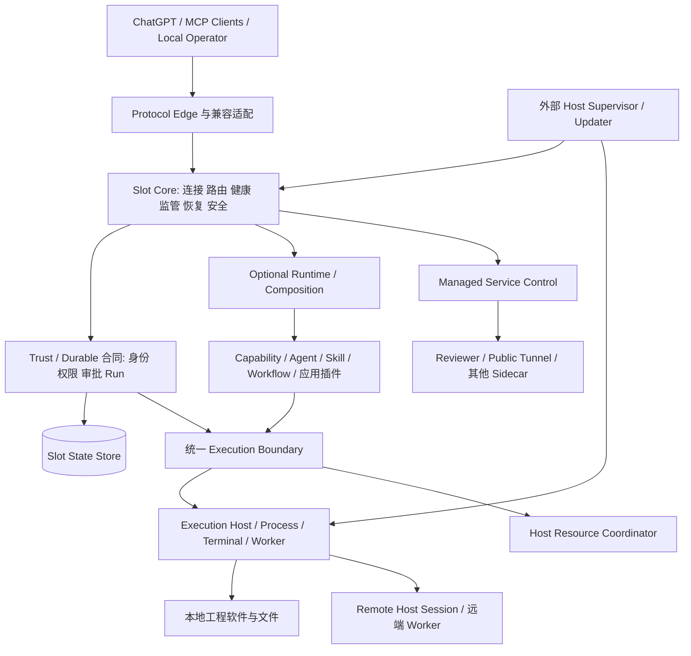
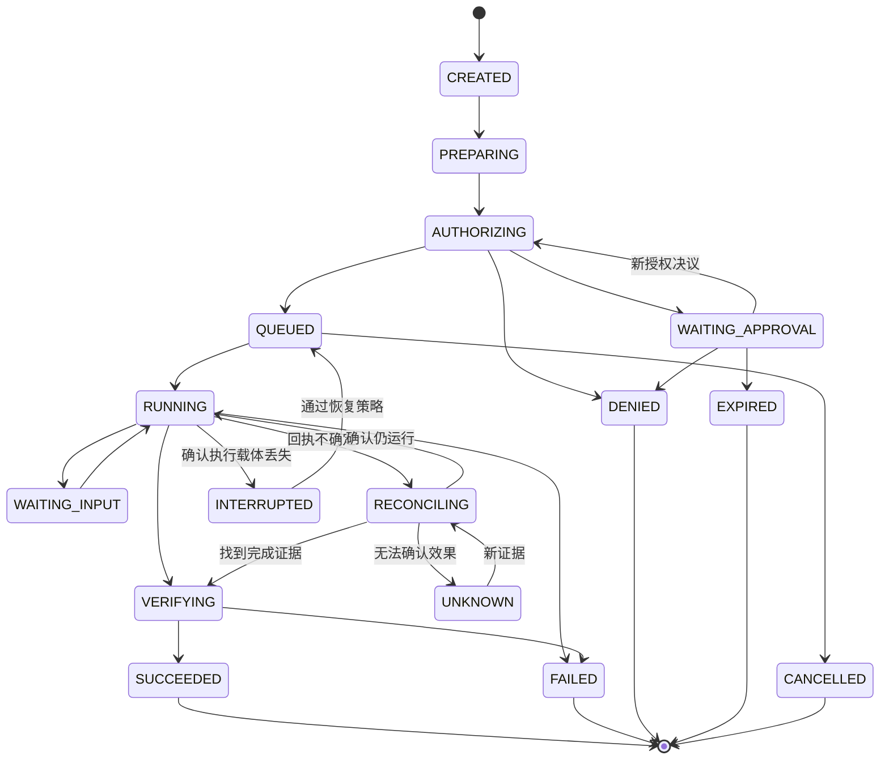
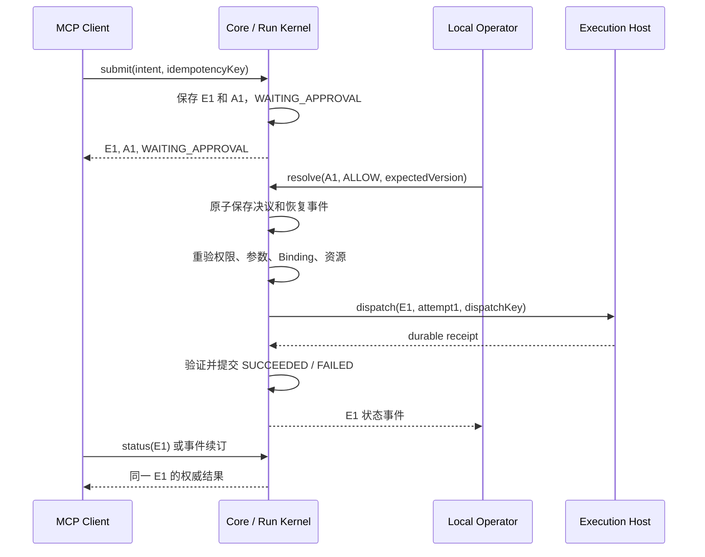
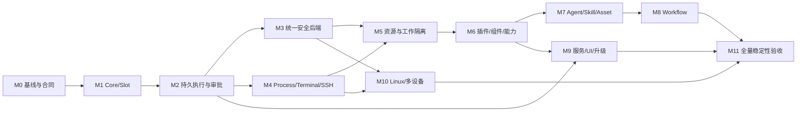

# P05 V3 完整技术方案：基于 V2 的工程 Agent 平台升级

| 项目 | 内容 |
|---|---|
| 文档版本 | 1.0，完整技术方案建议稿 |
| 编写日期 | 2026-09-28 |
| 状态 | 待项目负责人评审；已有 V3 需求继续有效，本文新增决策不冒充已批准 ADR |
| 产品与技术决策人 | 项目维护者；实施人员、排期和发布负责人在 M0 分配 |
| 需求基线 | `v3@56bbf7134af91229b00111a66849442e3c5143a0` |
| V2 源码检查基线 | `feature/shell-approval-gate@6c688398d744c113d3602b05f4164a51dff83aa2`；包含本机未提交改动 |
| V2 已提交集成参考 | `develop@5ea65814f83bdca3daf56b2b0b2617ea27392eec` |
| 关联事项 | V3 分支需求文档；尚未分配独立 Epic/Issue，不虚构审批或完成记录 |
| 外部调研 | 2026-09-28 核对官方仓库、说明文档和元数据；25 个仓库快照见配套 JSON |
| 交付性质 | 架构、合同、迁移和验收设计；不是已经实现或验证完成的产品说明 |

**总原则：V3 是在 V2 上进行功能升级和必要的架构强化。保留已验证能力及用户操作语义，通过适配、抽取、替换内部实现逐步升级，禁止用架构重建作为默认起点。**

本文给出完整目标和分阶段实现路径。阶段性交付不删减长期需求；尚需实验决定的实现机制均列出默认方向、备选、实验和停止条件。版本锁定以实施时通过的兼容性矩阵为准，不把 GitHub 默认分支直接用于生产。

## 阅读导航

- §1–4：目标、V2 继承基线、整体架构、术语与身份。
- §5–10：Core、协议、持久状态、执行完成、审批、安全执行。
- §11–18：进程终端、远程主机、资源、工作区、插件、能力、组件、资产。
- §19–25：Agent、Skill、Workflow、服务、Reviewer、Operator、跨平台与多设备。
- §26–29：部署升级、观测、性能目标、威胁与风险。
- §30–35：设计决策、技术实验、实施包、迁移、验收、需求追踪。
- §36–38：GitHub 参考方案、待验证问题和实施治理。

## 1. 目标、使用场景与范围

### 1.1 背景与问题

V2 已经使 ChatGPT 等客户端能够通过 MCP 访问本地工程文件、Git、PowerShell、MATLAB/Simulink，并提供 A/B 独立运行实例、本地 Operator、参考目录和外部只读审查。现有代码、部署脚本、测试、插件 API 和使用经验是 V3 的资产。

下一阶段需要处理的主要问题是：插件或配置故障影响恢复通道；审批完成仍依赖重新调用；调用超时无法直接说明执行结果；长任务和交互进程依附短请求；多 Slot 可能争用同一工程资源；权限声明缺少实际执行约束；Skill/Workflow 尚未形成可执行、可恢复的合同。

如果只继续增加工具函数，上述问题会重复进入每个插件。V3 应把公共执行和控制语义统一，同时保持业务扩展独立。

### 1.2 核心使用场景

| 场景 | 用户期望 | 必须提供的保证 |
|---|---|---|
| 本地开发 | 修改、构建、测试连续完成 | 工作区绑定稳定；有明确结果和产物 |
| 远程 Linux 开发 | 授权一次工程会话后正常开发 | 主机/用户/目录/权限/期限绑定；扩权时再审批 |
| MATLAB 与 Simulink | 多对话使用工程能力 | 会话资源协调、工作目录一致、模型修改可验证 |
| 长任务与重启 | 断线后知道任务发生了什么 | 稳定执行 ID、持久状态、禁止不确定重试 |
| 故障修复 | 插件坏了仍可远程诊断和修复 | 最小 Core 不依赖插件、Agent 或 UI |
| 自动工程流程 | 按既定流程迭代到完成条件 | 阶段、预算、审批、产物、停止原因可追踪 |
| 平台升级 | 升级失败仍有可用控制入口 | 候选版本验证、外部切换、已知良好版本回退 |

### 1.3 完整 V3 范围

完整目标包含：稳定 Core；独立 Slot；持久执行和审批；统一执行边界；Windows Host；Linux Host 的基础执行能力；SSH Remote Host Session；Process/Terminal；资源租约；工作隔离与结果整合；Plugin/Component/Fiber；语义 Capability/Binding；Asset/Artifact；可替换 Agent Provider；Skill/Workflow；通用受管服务；Operator/Reviewer；观测；安全升级；显式多设备委派的最小合同和验证。

以下不作为完整 V3 的必要交付：大型集群调度平台、通用包市场、任意应用的 GUI 自动化、所有硬件驱动、Linux 上复刻 Windows 专属工程软件、任意进程内存快照恢复、对外部副作用提供无条件 exactly-once 保证。必须保留扩展合同，但不凭空承诺这些能力。

### 1.4 约束与成功定义

1. A/B 能并行操作不同 Workspace；重启 A 不应隐式影响 B。
2. Operator 默认仍为本地控制面；服务安装和开机自启必须显式配置。
3. 兼容现有 MCP 客户端，不能把客户端支持新协议特性作为全部工作的前提。
4. 保留 V2 工具合同；破坏性升级必须有新版本和明确迁移。
5. Windows 为首个完整实现；Core 合同不嵌入 PowerShell、盘符或 systemd 语义。
6. 完成以行为测试和故障注入证据判定，不能只以接口存在或单元测试数量判定。

## 2. V2 继承基线与代码演进

### 2.1 基线冲突处理

`v3` 的 README 和部分早期议题描述的是较早 V2；较新的 `V3_INPUT_V2_CAPABILITY_ASSET_BASELINE.md` 已记载插件独立启停、Reference Roots、HTTP Reviewer 和统一审批。实施时采用“当前验证过的 V2 代码 + 最新接受需求”，不能从较旧 `v3` 源码恢复已淘汰行为。

本次检查时工作树有其他进行中的代码修改，尤其审批、Shell 和 Audit。本文不把这些改动视为已发布基线。M0 必须固定经维护者确认、完整验证通过的 V2 提交，并记录差异；本文不要求丢弃或强行合并未提交工作。

早期 Core 合同列有远端 `workspace_switch`，较新需求已明确 Workspace 授权归 Local Operator。本方案采用后者：Core 内部支持授权绑定变更，普通 Remote MCP 不获得自行扩大 Workspace 的权限。

### 2.2 32 类能力的继承处置

| V2 资产 | 继承方式 | V3 增量 | 落点 |
|---|---|---|---|
| CAP-001 MCP 连接 | 保留 SDK 与 stdio/Tunnel 入口 | 协议进程与持久 Slot 状态分离 | §6 |
| CAP-002 双 Runtime | 保留 A/B 使用方式 | 显式 Slot/Generation | §3–4 |
| CAP-003 状态隔离 | 保留每 Slot 隔离 | 持久执行库与命名空间 | §7 |
| CAP-004 设备身份 | 保留查询兼容字段 | hostId 与 slotId 分离 | §4 |
| CAP-005 ping | 保留 | liveness/readiness 分开 | §5 |
| CAP-006 Workspace | 复用 Manager 和校验 | 授权版本、不可变执行快照 | §14 |
| CAP-007 Reference Roots | 复用授权及读取 | 受限后端只读挂载 | §10、14 |
| CAP-008 Capability Catalog | 保留唯一目录 | 版本、效果、Binding | §16 |
| CAP-009 Tool Profiles | 保留四档 | 与更细权限规则取交集 | §9 |
| CAP-010 执行生命周期 | 演进现有 Runtime | Run、Attempt、Receipt 持久化 | §8 |
| CAP-011 Permission Broker | 复用决策入口 | 结构化权限、后端能力、规则版本 | §9 |
| CAP-012 Approval | 保留人工决策路径 | 挂起原执行、批准后自动恢复 | §8–9 |
| CAP-013 Audit | 保留脱敏原则 | 与 Run/Event/Trace 分离 | §27 |
| CAP-014 Recovery | 保留查询 | 直接状态查询和安全对账 | §8 |
| CAP-015 文件工具 | 复用路径和精确 patch 保护 | 显式执行上下文、内容前置条件 | §14 |
| CAP-016 Git | 复用受控本地操作 | worktree、合并验证、资源协调 | §14 |
| CAP-017 平台验证 | 保留命名操作 | 可信 Runner，分离构建源码与控制器 | §10、26 |
| CAP-018 Shell | 保留兼容工具 | 持久 Process、沙箱、会话权限 | §10–12 |
| CAP-019 生命周期 | 保留按 Slot 重启 | 接受/健康完成、外部执行 Receipt | §5、26 |
| CAP-020 Plugin API | v1 适配层保留 | 进程桥与声明式贡献 | §15 |
| CAP-021 插件启停 | 复用业务行为 | desired/observed、持久配置、排空 | §15 |
| CAP-022 Downstream MCP | 复用客户端适配 | 每调用身份、隔离、输出限制 | §15 |
| CAP-023 MATLAB | 复用现有 Plugin | 共享会话租约、效果标注 | §13、15 |
| CAP-024 MATLAB Skills | 保留只读目录 | guidance 与可执行 Skill 区分 | §20 |
| CAP-025 Operator | 渐进改造现有页面 | 通用 Run/Approval/Service 视图 | §24 |
| CAP-026 HTTP Reviewer | 保留独立只读服务 | 通用受管服务与授权上下文 API | §22–23 |
| CAP-027 OAuth | 保留已验证流程 | 认证主体绑定、撤销与协议回归 | §23 |
| CAP-028 公网测试入口 | 保留测试路径 | 独立受管 Tunnel；生产路径另行配置 | §22 |
| CAP-029 ToolAnnotations | 保留自动生成 | 与效果合同一致，不作为授权依据 | §6、16 |
| CAP-030 Bootstrap | 复用仓库本地部署 | 版本清单、可信安装与宿主探测 | §26 |
| CAP-031 部署控制 | 复用 A/B 脚本语义 | Host Adapter、候选/回退 | §25–26 |
| CAP-032 验证资产 | 保留现有测试 | 合同、迁移、故障、隔离测试 | §34 |

### 2.3 现有代码的迁移接缝

下列路径用于指出已存在的复用位置，不要求一次性重排目录。

| 当前模块 | 第一轮改变 | 不应重写的部分 |
|---|---|---|
| `src/index.ts` | 抽离启动阶段和 Optional Runtime 装配 | 已有工具分组、SDK 使用 |
| `src/policy/expose.ts` | 包装为兼容 Edge，接入提交执行合同 | schema/annotation/暴露检查 |
| `src/runtime/execution.ts` | 引入 StateStore、Execution ID、异步任务 | 阶段分类、错误映射 |
| `src/approval/tool-approval.ts` | JSON 记录迁移到版本化审批服务 | 精确意图绑定和本地审批原则 |
| `src/security.ts` | 提取 HostPathPolicy 与操作合同 | Windows 特殊路径、敏感路径、真实路径检查 |
| `src/workspace/*`、`src/reference/*` | 增加授权版本和快照 | 注册、持久化、只读参考语义 |
| `src/plugin/*`、`src/downstream/*` | 增加进程桥和调用授权上下文 | 业务适配、懒连接、插件所有权 |
| `src/plugins/matlab/*` | 从当前工作区 getter 转为调用快照 | 工具发现、Skill 目录、MathWorks 集成 |
| `src/operator/*` | 消费统一控制 API/事件 | 本地入口、Slot 选择、基本展示 |
| `src/http/reviewer.ts` | 通过受限接口获取 Slot 上下文 | 只读工具、OAuth、原生 HTTP MCP |
| `scripts/deployment/*` | 包装为 Host lifecycle 实现 | 手动启停、仓库本地工具、配置经验 |

## 3. 整体架构与进程部署

### 3.1 逻辑架构



逻辑层次不等同于每层一个服务。第一版保持 Node.js/TypeScript 主体，复用现有 SDK、Zod 和业务代码；仅为故障隔离、宿主权限或资源所有权引入进程边界。

### 3.2 物理部署决策

| 单元 | 默认实例数 | 生命周期 | 是否承载权威状态 |
|---|---|---|---|
| Host Supervisor/Launcher | 每 Host 一个 | 用户手动启动；可显式配置系统服务 | 安装版本、Slot generation 切换 |
| Slot Core | 每启用 Slot 一个 | 不依赖 Operator 窗口或单次 MCP 请求 | Slot 身份、权限、执行状态 |
| stdio Edge shim | 每客户端连接一个 | 随连接 | 无，映射至常驻 Slot Core |
| Optional Runtime Host | 每 Slot 一个起步 | 可独立启停 | 业务域状态通过受控 Store API 保存 |
| Execution Host | 每 Slot 按需一个 | 可跨 Core 重连存活 | 进程/PTY 句柄与有界 Receipt spool |
| Host Resource Coordinator | 需要共享资源时一个 | 独立受管服务 | Host 资源登记、租约、fencing epoch |
| Reviewer/Tunnel | 按服务描述注册 | 与 Slot 独立 | 自己的业务状态，不拥有 Slot 权限 |
| 非信任插件 Host | 按信任域拆分 | 受监督 | 不直连可信数据库 |

旧 Tunnel 启动 `dist/index.js` 的入口先由兼容模式保留，再替换为能连接指定 Slot Core 的 Edge shim。不能因为 stdio EOF 就销毁已接受 Run。直接本地使用 stdio 的用户也经同一启动器建立 Slot Core；停止连接和停止 Slot 是不同操作。

不引入 Redis、Kafka、Kubernetes 或 Temporal Server 作为默认部署前提。借鉴它们的可靠性机制，避免把本地工作站产品变成集群运维项目。

### 3.3 IPC 与信任边界

默认内部 IPC 使用 Windows named pipe / Linux Unix domain socket，权限仅授予实际需要的身份。复用现有 loopback HTTP 控制桥作为迁移适配器，必须具备随机会话凭据、来源限制、消息大小限制与版本协商。

桥接请求固定携带 `protocolVersion/requestId/slotId/instanceGeneration`；执行相关请求额外携带 `executionId/contextRef`，健康请求不伪造执行身份。响应固定携带对应关联字段。对端身份由受保护端点/握手建立，不能相信调用方自填的 Slot、用户或权限字符串。新控制命令拒绝过期 generation；历史回执按原 Attempt 的执行器身份校验，不能因 Core 重启就全部拒绝。未知方法和未知字段不得导致隐式扩权。

Core 注册的是已安装组件清单和 schema，不能导入业务模块来获取恢复工具。可选模块 import-time exception、死循环和 native crash 的隔离必须由进程边界验证。

### 3.4 故障范围

Optional Host 故障影响该 Slot 的可选能力；Execution Host 故障使相关任务进入恢复状态；资源协调器故障阻止新的共享资源操作，但不阻止本地独立文件读取；Operator 或外网 Tunnel 故障不等同于 Core 未就绪。

可信状态库不可写时，Core 保留最小无副作用诊断，但停止需要审批、持久操作记录的执行。可观测性 exporter 故障可以降级，安全权威记录缺失不能用“降级可用”绕过。

## 4. 领域模型、身份与不可变上下文

### 4.1 术语合同

| 概念 | 唯一责任 | 不等同于 |
|---|---|---|
| Host | 物理/OS 执行节点身份 | IP、Slot、PID |
| Slot | 稳定工作通道 A/B/未来 C | 冗余连接 |
| Core Instance | 一次进程 generation | 长期 Host 身份 |
| Workspace | 经授权的工程范围 | 任意 cwd |
| Run | 持久工作信封 | MCP 请求、Fiber |
| Execution | 对外可提交和查询的 Run 投影 | 一次网络等待 |
| Invocation | 对一个 Capability 的逻辑调用 | 重试 Attempt |
| Attempt | 一次实际派发尝试 | 新的用户任务 |
| Approval | 一项授权决策请求 | 任务本身 |
| Grant | 有范围、期限和撤销语义的授权 | 工具可见性 |
| Capability | 稳定语义与输入输出合同 | 脚本文件名 |
| Binding | Capability 的版本化实现 | 权限来源 |
| Plugin | 安装包和贡献所有权 | 单一进程或资源 |
| Component / Fiber | 运行单元定义 / 活实例 | 持久 Run |
| Asset / Artifact | 可复用版本材料 / 本次产物 | 自动互相转换 |
| Remote Host Session | 远端身份和权限上下文 | 一条 SSH TCP 连接 |

第一版 `executionId` 与根执行 `runId` 使用同一标识值，避免两份状态；两者是不同 API 视角。子 Run 使用 parentRunId，Invocation 和 Attempt 仍有独立 ID。今后若需要一对多映射，必须发布合同升级。

### 4.2 身份字段

公共关联最少包括：`hostId, slotId, coreInstanceId, instanceGeneration, clientPrincipalId, actorId, workspaceId, workspaceRevision, runId, invocationId, attemptId`。按场景增加 `pluginId/componentId/fiberId/agentSessionId/remoteHostId/remoteSessionId/resourceLeaseId`。

Host 身份由本机受保护的安装状态保存，A/B 返回相同 hostId；旧 deviceId 保留为 deprecated 的兼容标识，不能在无迁移说明下改变旧客户端的主键含义。generation 使用随机实例 ID 加单调版本防止 PID 重用或旧进程复活。

区分 `coreGeneration`、`executorBootId` 和 `dispatchEpoch`：前者决定谁可发出新控制命令，后两者固定在 Attempt 上，证明是谁接受了该次执行。Core 换代后，通过受认证的接管握手更新控制权，但不修改历史 Attempt。存活 Execution Host 可继续上报旧 dispatchEpoch 的已登记回执；未知 Attempt、摘要不一致或旧 Core 发来的新 dispatch 一律拒绝。资源 fencingEpoch 独立管理，不因接收历史回执而回退。

### 4.3 ExecutionContext

创建时捕获并保存：执行主体、创建来源、Workspace ID/真实根/授权版本、Reference 授权版本、工作隔离 ID、权限上限、安全模式要求、远端会话绑定、父子关系、预算和 trace。

敏感真实路径不必全部返回远端；内部快照与公共投影分开。上下文不可原地改写；授权扩大通过新的 Grant/AuthorizationDecision 记录关联原执行，不伪造原创建事实。

Workspace 切换只影响后续请求。旧 Run 继续使用旧快照，但每次真正产生效果前重新检查撤销和政策版本；根授权被撤销后，旧快照不是继续执行的通行证。

## 5. Core 启动、生存能力与监督

### 5.1 启动顺序

1. 建立 Slot/Generation 锁并启动最小存活探针；未认证时不暴露敏感诊断。
2. 加载 Bootstrap Trust State：Host、恢复根、安装版本、Policy/凭据位置；打开并验证可信 StateStore。
3. 重建执行/审批索引和撤销状态，登记待对账任务；不等待所有外部任务完成对账才继续启动。
4. 建立受控恢复文件/Git/配置能力，发布明确 mode/readiness；可信存储或权限不可用时进入 LOCKED，不能提前宣布可写 Core Ready。隔离损坏的非权威配置。
5. 异步接入 Optional Runtime、服务和路由。

| 模式 | 进入条件 | 可用能力 |
|---|---|---|
| NORMAL | 核心和预期可选服务正常 | 授权允许的全部能力 |
| DEGRADED | 部分可选组件失败 | Core 恢复面，其他健康能力 |
| RECOVERY | 用户安全启动或普通配置损坏 | 最小恢复面；可选层不自动加载 |
| LOCKED | 无法确立可信权限或安全持久状态 | ping、身份、脱敏诊断；禁止写/Git mutation/Shell |

`core_status` 必须分别返回 liveness、readiness、mode、connectionState、optionalHealth、storageHealth；不得用单个 online 布尔值混合含义。

### 5.2 监督合同

Supervisor 控制 P05 注册并拥有的进程，记录 executableDigest、ownerSlot、generation、启动时间和端点证据。禁止仅凭进程名杀进程。心跳检测与业务健康检查分开；重启采用退避、抖动、重启预算和显式 crash_loop。

建议初始值：10 秒心跳，连续 3 次缺失进入 suspect；5 分钟 3 次非预期崩溃进入 crash_loop，等待人工或指定策略恢复。这些是可调整产品默认值，不是本次测量结果。

重启先停止新任务接收，再排空可完成任务；不能安全中断的硬件操作保持占用或进入人工恢复。Core 升级走外部 Updater，不由要替换的进程独自证明自身成功。

### 5.3 恢复能力边界

保留文件读取、精确 patch、本地 Git、配置检查、组件禁用和受控 break-glass。普通恢复不能任意修改可信安装、审批记录和安全策略；涉及信任根修复时走本地 Operator/受信维护路径。

Core 路由名保留，Optional route 冲突仅拒绝冲突贡献。损坏日志或可重建观测数据不阻止启动；Bootstrap Trust State 不可通过“忽略错误”扩大权限。

参考：WinSW 用于 Windows 服务包装机制比较；controller-runtime 用于期望/实际状态收敛模式比较。P05 的 Slot 权限与恢复合同由本项目定义。[R10](https://github.com/winsw/winsw) [R11](https://github.com/kubernetes-sigs/controller-runtime)

## 6. MCP / API / 协议兼容

### 6.1 Edge 原则

继续使用现有 MCP TypeScript SDK。核对时官方 `@modelcontextprotocol/server` 文档说明 v2 为稳定系列；实施以项目 lockfile 和客户端兼容测试锁定版本，不能仅依据协议发布日期升级。[R01](https://github.com/modelcontextprotocol/typescript-sdk/blob/main/packages/server/README.md)

协议 Session 仅保存认证、能力协商、订阅游标和返回通道。Run、Approval、Workspace 权限都属于 P05。支持通知/新任务协议的客户端可获得事件体验；所有客户端均有 submit/status/events 的工具回退路径。

### 6.2 公共工具合同

| 逻辑接口 | 主要输入 | 输出与行为 |
|---|---|---|
| `execution_submit` | capability、arguments、idempotencyKey、waitMs、可选上下文句柄 | executionId、state、waitOutcome、result/approval/nextAction |
| `execution_status` | executionId | 权威状态、当前 Attempt、待审批、结果引用、状态版本 |
| `execution_wait` | executionId、afterVersion、waitMs | 有界等待状态变化；超时不改变执行状态 |
| `execution_events` | executionId、afterSequence、limit | 有序事件、nextCursor、gap/retention 信息 |
| `execution_cancel` | executionId、reason | cancelRequested；待执行器确认后终止 |
| `execution_reconcile` | executionId、已支持的对账模式 | 权威证据核对结果；无任意状态覆盖 |
| `capability_list/describe` | scope/filter/id | 语义合同、当前可用实现与约束 |
| `core_status` | Slot 上下文 | 身份、模式、就绪、依赖健康 |

客户端只能引用已经授权的上下文句柄，不能上传一个 ExecutionContext 来替代服务器的授权捕获。

示例响应合同：

```json
{
  "schemaVersion": "p05.execution.v1",
  "executionId": "run-example",
  "state": "WAITING_APPROVAL",
  "stateVersion": 4,
  "waitOutcome": "state_changed",
  "approval": {"approvalId": "approval-example", "status": "PENDING"},
  "nextAction": "await_operator",
  "result": null
}
```

所有查询均检查 caller 与目标执行的访问关系；ID 是定位符，不是权限凭据。枚举和输出接口不得泄漏其他 Slot、Workspace、租约或客户端的内容。

### 6.3 V2 工具兼容策略

旧同步工具保留原 outputSchema，不得把“已接受”伪装成原来的“执行成功”。按客户端能力或显式 API 版本启用 V3 执行信封。旧客户端短操作正常返回；超出等待窗或需审批时返回可读状态与执行 ID，不改变原 schema 为不匹配对象。

兼容适配器要特别处理旧“审批后重试”：通过原请求上下文/执行 ID 关联到已有 Run，返回其状态，而不是再次执行。仅对没有执行句柄的旧客户端提供短期、明确限定的 pending-call 指纹映射；不能永久按相同参数去重，因为用户可能合法执行两次相同操作。

ToolAnnotations 从 Capability 元数据生成，只是提示。运行时仍检查 profile、权限、授权版本、执行后端与效果。客户端自报名称/版本用于审计，不能用作可信主体。

### 6.4 统一错误与分页合同

错误字段固定为 `code/message/retryable/executionId/stateVersion/diagnosticRef/nextAction`；没有受理 Run 时 executionId 为空。`retryable=true` 仅表示可以重试查询或按原幂等键继续协议，不自动许可重新产生副作用。

| 错误类 | 代表代码 | 客户端处理 |
|---|---|---|
| 输入/版本 | INVALID_ARGUMENT、SCHEMA_MISMATCH、UNSUPPORTED_CAPABILITY | 修正请求或选择兼容能力 |
| 身份/权限 | UNAUTHENTICATED、DENIED、GRANT_EXPIRED、CONTEXT_REVOKED | 重新认证或请求明确授权；不能换工具绕过 |
| 并发/意图 | STALE_VERSION、IDEMPOTENCY_CONFLICT、IDEMPOTENCY_EXPIRED | 刷新事实；区分继续旧请求与新的用户意图 |
| 可用性/容量 | DEPENDENCY_UNAVAILABLE、RESOURCE_BUSY、QUOTA_EXCEEDED | 按同一意图等待或有界退避 |
| 持久性/恢复 | STORAGE_UNAVAILABLE、OUTCOME_UNKNOWN、RECONCILIATION_REQUIRED | 查询/对账；不盲目重提 mutation |
| 输出/事件 | OUTPUT_TRUNCATED、EVENT_GAP、ARTIFACT_EXPIRED | 读取快照/可用产物，明确缺失部分 |

列表分页使用不透明 cursor，绑定查询主体、过滤条件和快照/排序基准；不得把 cursor 当作授权。状态响应带 stateVersion，事件带 sequence；最终终态可重复读取。列表中的摘要不能替代 `execution_status` 的权威详情。

控制入口按职责分开：Agent/MCP 提交和观察已授权执行；本地 Operator 处理审批、授权根和受管服务；Supervisor/Execution Host 使用受保护内部协议。process/terminal、host-session、plugin/service、agent/skill/workflow 的操作名按各节合同落地，统一使用版本化 schema、ID、CAS 和权限检查；禁止仅靠路由名推断安全等级。

## 7. 持久状态、存储和事件

### 7.1 存储选择与所有权

默认选择每 Slot 一份本机 SQLite 数据库，封装 StateStore 接口；Host 资源协调器单独拥有 host-resource 库。Core 是 Slot 可信状态的逻辑写入者；Optional Runtime、Reviewer、UI 通过受控接口访问，不能持有数据库文件句柄。

SQLite WAL 可允许读写并行但仍只有一个同时写入者，且不适合跨机器共享网络文件。对 P05 的含义是短事务、显式背压、本机磁盘和禁止跨节点共享 DB。关键提交采用同步持久设置，并记录有效设置；不能把较弱同步模式的性能当作掉电持久保证。[R26](https://www.sqlite.org/wal.html)

默认绑定候选为 better-sqlite3，置于受控存储线程以避免阻塞协议循环；对比 Node 内置 SQLite 作为替代。是否引入 native 包由 P02 的 Windows 安装、锁、备份和故障结果确定。[R06](https://github.com/WiseLibs/better-sqlite3)

### 7.2 逻辑数据表

| 表/集合 | 关键字段 | 约束 |
|---|---|---|
| runs | id、kind、parentId、contextRef、state、stateVersion、createdAt、deadline | 乐观并发；终态不可无证据改写 |
| execution_contexts | id、主体、Workspace 快照、权限上限、版本 | 创建后不可变 |
| run_events | runId、sequence、type、payloadRef、time | `(runId, sequence)` 唯一、有序 |
| invocations | id、runId、capabilityVersion、bindingVersion、inputDigest | 固定本次语义与实现 |
| attempts | id、invocationId、number、dispatchKey、status、receiptRef | 派发键唯一；次数有界 |
| approvals | id、executionId、intentDigest、scope、expiry、decisionVersion、status | CAS 决策，ALLOW/DENY/EXPIRE 互斥 |
| grants | id、主体、权限集合、边界、期限、policyRevision、revokedAt | 可撤销、不可隐式扩大 |
| outbox | id、event/command、dedupKey、deliveryState | 与权威状态同事务写入 |
| inbox/receipts | sender、executorBootId、dispatchEpoch、dispatchKey、sequence、digest | 重复去重；验证原 Attempt 身份；不因 Core 换代丢弃合法旧回执 |
| service_desired | serviceId、scope、revision、intent | 持久配置事实 |
| workflow_state | runId、definitionDigest、stage、iteration、refs | 通过命名空间 API 写入 |
| artifacts/assets | id、digest、version、producer/owner、retention | 内容寻址、权限继承 |
| idempotency_keys | principal、Slot、apiOperation、key、intentDigest、executionId、expiry | 同作用域 key 异意图报冲突 |
| audit_records | eventId、actor、decision、effect、refs | 元数据优先，追加语义 |

Host 库另外保存 resources、leases、fencing epochs、受管进程登记；不保存所有 Slot 的可变 Workspace。跨库操作不承诺单一事务，使用幂等请求和可恢复状态机。

### 7.3 原子边界

以下必须同事务：Run 状态变化 + 事件追加；创建审批 + Run 进入等待；审批决议 + 待恢复 outbox；一次性授权预留 + Attempt 准备 + 派发 outbox；接收执行 Receipt + Invocation/Run 状态更新。

实际 OS 操作与 DB 无法构成普通本地事务。使用“先持久登记，再派发；幂等接收；回执持久化；不确定时对账”。不能把事务 outbox 宣称为任意外部动作 exactly-once。

### 7.4 请求内容与机密

Audit 继续不保存原始命令、文件内容和秘密。自动恢复却需要足够执行输入，因此另设受保护的 Execution Payload Store：有大小/期限上限，内容哈希，敏感字段加密或仅保存 SecretRef，密钥由 OS 保护的凭据机制提供。

不能恢复的秘密只在内存存在；重启后进入 WAITING_INPUT 重新提供。数据库中只有 digest 而没有输入内容时，不得承诺自动重放任意调用。Payload 不进入 Git、不进入普通诊断和模型上下文。

### 7.5 备份、保留和故障

通过 SQLite backup API 或经过停写验证的一致性快照备份，不直接复制活跃 WAL 数据库主文件。备份记录 schema 版本、摘要和恢复验证结果。[R27](https://www.sqlite.org/backup.html)

保留期统一以 §27.3 为准：运行元数据 90 天、审计 180 天、普通输出 14 天，每 Slot 输出 spool 总上限初值 1 GiB。活跃任务、待审批和工程留存标记不自动删除；活跃任务的超量输出可按声明策略截断，但状态与回执不可丢弃。达到容量上限时先停止接收需要新增持久状态的任务，保留诊断与受控取消。

事件采用至少一次传递，按 sequence 去重；游标过期返回 EVENT_GAP 和快照入口。订阅失败不丢权威状态。普通 Trace 可以采样，安全授权和执行状态不能靠采样代替。

## 8. Durable Run 与执行完成

### 8.1 状态模型



补充 WAITING_DEPENDENCY、PAUSED 为非终态。所有允许取消的非终态先记录 `cancelRequested`，只有确认已停止或从未派发才进入 CANCELLED。UNKNOWN/INTERRUPTED 是需恢复判断的状态，不能自动当作 FAILED 或重新执行；最终放弃时进入 FAILED 并保存原因。

图展示主路径；实现使用完整转移表。等待态保存 `resumePhase/reason/checkpointRef`：缺少输入可发生于准备阶段或运行阶段，恢复后回到记录的阶段，并在下次副作用前重新授权；WAITING_DEPENDENCY 恢复同理。PAUSED 只用于已到安全检查点的可暂停编排，不能宣称任意 OS 进程已暂停。PREPARING/AUTHORIZING/QUEUED 的确定错误可进入 FAILED；尚未派发的取消可直接进入 CANCELLED。RUNNING 的取消必须等待执行器证据，迟到回执按事实记录完成和取消请求的先后，不能抹去已完成副作用。

状态机验证由纯转移规则承担，可用 XState 辅助建模/测试；持久事务仍由 StateStore 保证。XState snapshot 的保存与恢复不自动保证任意外部副作用安全恢复。[R04](https://github.com/statelyai/xstate) [R28](https://stately.ai/docs/persistence)

### 8.2 受理、派发与回执

1. 校验请求和幂等键，捕获 ExecutionContext，持久写入 Run。
2. 返回执行 ID 或进行有界等待；网络响应丢失时客户端按幂等键找回同一执行。
3. 准备阶段解析 Binding、输入引用和前置条件，不产生工程副作用。
4. 运行 Permission Broker；需要审批则保存 WAITING_APPROVAL。
5. 有权限后申请必要资源；等待资源期间不提前消耗一次性执行授权。
6. 最终重验授权/撤销、Binding 摘要、输入前置条件和资源租约。
7. 原子写入 Attempt、派发键、授权预留与 outbox。
8. Execution Host 验证受保护通道、请求期限和当前控制 generation，在自己的 spool 登记 dispatchKey、executorBootId 与 dispatchEpoch。
9. 执行、采集输出和退出证据；将 Receipt 持久保存后报告 Core。
10. Core 校验 Receipt，执行后置验证，更新结果、事件和 Audit。

会断开当前连接的 restart/upgrade 等操作增加 `ackBarrier`：持久登记接受状态并向当前 transport 写出接受回执后，才解除 Supervisor 派发条件；可获得 flush/写入确认时必须等待。崩溃使 barrier 是否释放不确定时由持久意图对账，不直接重启第二次。网络层无法保证人类已经看到响应，所以稳定 ID、幂等找回和重连查询仍然必要，不能把 `ackSentAt` 描述为客户端已消费证明。

Receipt 至少包含 dispatchKey、Execution/Attempt、executorId、executorBootId、dispatchEpoch、backend、启动/结束时间、退出/信号、输出/产物摘要、实际隔离级别和验证依据。历史回执适用 §4.2 的接管规则。来自普通插件的“success”只是输入证据；安全与硬件关键操作由独立后置检查确认。

### 8.3 审批自动续跑时序



Operator 和客户端均不需要模拟第二次工具调用。重复点击审批只返回同一决议；批准后取消、期限到达、Workspace 撤销等竞争由 CAS 和最终派发检查决定。

### 8.4 超时分类

| 超时 | 意义 | 执行动作 |
|---|---|---|
| transport/request | 请求通道等待失败 | 保留 Run，允许找回 |
| caller-wait | 调用者不再等待 | 返回 waitOutcome，Run 不变 |
| approval | 授权等待过期 | EXPIRED，禁止派发 |
| queue/resource | 排队预算用完 | 明确失败/等待策略，不执行 |
| execution | 整体任务运行期限 | 请求取消，验证停止情况 |
| child-process | 子进程期限 | 终止其所属进程树并记录证据 |
| stabilization | 新服务未在窗口内就绪 | 生命周期操作失败，触发规定回退 |
| report | 完成回执未送达 | RECONCILING，不推断失败 |

默认 `waitMs` 最大 30 秒；长任务使用 ID 等待，不无限延长 MCP 请求。执行期限、审批期限和队列期限分别配置，不允许调用者隐式关闭平台上限。

### 8.5 崩溃窗口与恢复规则

| 故障位置 | 恢复判断 | 禁止行为 |
|---|---|---|
| Run 保存前 | 未受理，按幂等键安全再提交 | 声称已开始 |
| Run 已保存、未派发 | 恢复队列并重新授权 | 丢弃批准状态或复制任务 |
| outbox 已保存、接收未知 | 用同 dispatchKey 查询/重送 | 换新键盲目启动 |
| 执行器登记但 spawn 证据不完整 | 核对 owned-process 登记；不能确认则 UNKNOWN | 根据“没 Receipt”推断没执行 |
| 外部动作成功、Receipt 未确认 | 后置验证或目标幂等键对账 | 重复 push、烧录、重启 |
| Core 重启、Execution Host 存活 | 重新握手、校验 owner/generation、接管观察 | 把仍运行任务全部判失败 |
| Execution Host 崩溃 | 检查进程树及可恢复后端 | 声称普通 OS 进程可从中间指令恢复 |
| Host 重启 | 确认旧载体消失，按效果和检查点恢复 | 自动重放全部 RUNNING |

持久化仅保证可解释、可对账；能否续跑由执行后端决定。Shell 的退出码 0 只证明命令进程成功退出；需要产物、服务健康或工程验证的 Capability 必须继续验证。

### 8.6 重试与去重

幂等键的唯一范围为 principal + Slot + API operation + caller key，记录规范化意图摘要。相同键、不同意图报 IDEMPOTENCY_CONFLICT。键保留期限不得短于该 Run 和不确定副作用的恢复期限。

重试决策读取 `effectClass + retrySafety + verificationContract`：只读可有界重试；外部 mutation 只有目标支持幂等键或有确定未执行证据才重试；硬件或不可逆动作默认人工核对。取消不是回滚。

参考 Temporal 的工作与副作用边界、DBOS 的持久步骤和队列思路，但默认不引入其完整部署依赖。DBOS 当前 TypeScript 主线说明基于 PostgreSQL，不能把它误列为可直接替换本方案 SQLite 的库。[R02](https://github.com/temporalio/sdk-typescript) [R03](https://github.com/dbos-inc/dbos-transact-ts)

## 9. 权限、审批与可持久规则

### 9.1 两个独立维度

| 维度 | 值示例 | 用途 |
|---|---|---|
| Effect class | E0 纯计算；E1 组件局部注册；E2 受管资源；E3 持久外部修改；E4 不可逆/提升权限 | 生命周期、恢复、重试、补偿 |
| Authority/effect scopes | Read、WorkspaceWrite、Execute、LocalGit、Network、External、HostWrite、PrivilegeEscalation、Hardware | 决定允许访问与修改的范围 |

一次执行可有多个权限标签。一般文件读取无工程写效果但仍需要 Read 权限；Git push 同时涉及 Network/External；创建 PTY 是 E2，却不能因此获得主机任意写权限。

### 9.2 决策顺序

1. 验证真实主体、Slot、授权 Workspace/Remote Session。
2. 检查平台不可覆盖约束、显式 DENY、撤销和有效期。
3. 检查 Tool Profile 与 Capability 暴露上限。
4. 解析本次实际效果、Binding 信任、执行环境和资源需求。
5. 与现有 Grant、持久规则和安全后端的实际能力取交集。
6. 仍缺少可授权范围则 CONFIRM；不允许授予或无法满足安全约束则 DENY。
7. 返回决策原因、缺失权限、有效 Policy Revision 和审批摘要。

Global/Host → Slot → Workspace → Plugin/Component → Capability/Operation 的层级采用限制累积：子级可以收紧，不能静默放宽父级硬限制。临时例外必须是拥有委派权的本地主体发出的显式 Grant，记录适用范围和来源。DENY 与撤销优先于普通 allow 规则。

### 9.3 Approval / Grant 合同

Approval 绑定执行 ID、意图摘要、输入内容摘要、Capability/Binding 版本、Host/Principal/Workspace、请求权限、可选租约、期限和决议版本。Approval 与 Grant 分开：批准一次操作生成受限的一次性 Grant；批准 Session 生成有期限、可撤销、多次使用但范围固定的 Grant。

支持范围：一次 Invocation、当前 Run、Remote Host Session、当前 Runtime Session、显式持久 Host/Workspace 规则。Runtime Session 不能等同于永不结束的后台进程，必须定义期限和 generation/重连策略。

一次性授权在最后一次本地 preflight 成功后与 Attempt 派发准备原子绑定。派发前失败可回到准备态而不生成第二次人工审批；派发结果不确定时不能“退还”后重做。可安全重试的 Attempt 仍属于原 Invocation，记录原授权使用账本。

审批后输入文件、脚本、Binding 或目标路径变化时，比较已批准的摘要和前置条件；影响意图的变化必须重新审批或拒绝，不能消费旧批准执行新内容。

### 9.4 持久规则

规则结构：ruleId、版本、主体集合、Host/Workspace/Plugin/Capability 匹配、权限集合、约束、ALLOW/CONFIRM/DENY、期限、创建人、撤销信息。界面展示实际授权范围，禁止默认提供“永远允许任意 SSH/Python/npm”的宽泛命令字符串规则。

初期复用 V2 Broker 并增加结构化规则，不先替换成通用政策语言。Cedar 的主体/动作/资源模型和 OPA 的决策接口作为备选；当跨租户或大量政策维护成为真实需求时再评估引入。[R21](https://github.com/cedar-policy/cedar) [R20](https://github.com/open-policy-agent/opa)

### 9.5 撤销传播

撤销立即阻止新派发；已运行任务执行预先声明的策略：可安全停止则取消，需要保持硬件安全状态则进入受限收尾，无法确定时隔离并要求人工。关闭网络连接本身不能证明撤销已经停止远端进程。

Core 重启后重新加载撤销版本；任何离线票据具有短期限，不能无限持有旧授权。审批记录、Grant 和决策历史只可经可信 API 修改。

## 10. 统一执行边界与实际隔离

### 10.1 ExecutionBackend 合同

后端描述必须返回：backendId/version、支持平台、filesystemEnforcement、networkEnforcement、principalIsolation、processTreeControl、secretDelivery、readOnlyReference、reattachSupport、limitations、probeTime。

请求描述：受保护的 ExecutionContext 引用、规范化操作/argv、WorkingRoot、只读引用、网络策略、环境变量白名单、资源限制、授权票据和输入摘要。结果包含实际采用模式，不允许把请求的 sandbox 名称当作已生效证据。

执行计划中的所有副作用均通过同一授权边界。插件内部直接 spawn、下游进程继承宿主权限、Agent 自带工具等都是需要约束的路径，不能只保护 `shell_run`。

### 10.2 安全模式与后端选择

| 模式 | 使用范围 | 必须诚实说明的限制 |
|---|---|---|
| trusted-host | 经明确授权的本机工程应用和遗留流程 | 不能防御同一 OS 用户下的任意恶意代码 |
| constrained-host | 实际可强制的文件/身份/网络约束 | 分别报告每个维度，不能用统一强度标签掩盖缺项 |
| isolated-worker | 独立用户/容器/VM 等隔离载体 | 仍需验证挂载、凭据、网络、设备穿透 |

Windows 首选研究已存在的原生受限执行方案与独立低权限用户/ACL/防火墙机制；Linux 研究 bubblewrap/namespace、受控用户、cgroup 与容器方案。由 P04/P05 输出能力矩阵后选定适配器。生产环境缺少指定隔离能力时，拒绝该受限任务或显式重新授权为 trusted-host，禁止静默降级。

OpenAI 的 Windows 沙箱工程说明和开源 Codex 提供实际工程参考；这不表示 P05 可直接调用 Codex 内部 helper 作为稳定公共 API。应选择有明确分发、维护和兼容责任的适配方式。[R07](https://github.com/openai/codex) [R29](https://openai.com/index/building-codex-windows-sandbox/) Linux 候选 bubblewrap 也需要由调用方正确配置策略，不自动构成完整 P05 安全模型。[R09](https://github.com/containers/bubblewrap)

### 10.3 Trust Kernel 与可信 Runner

开发工作树和执行中的可信版本分离。Agent 可以修改候选源码，不能直接覆写已安装的 Policy、Approval verifier、Updater、状态完整性模块。可信版本采用受保护目录、固定 manifest/digest 和窄入口；高权限安装与运行分开。

`command_run(check/build/verify)` 仍针对 platform-source，但使用可信 Runner 解释固定操作合同。工程源码和测试本身可执行任意代码，因此 Runner 必须把这些代码放进所声明的隔离环境；仅把 npm 命令写死不构成可信执行。

在 trusted-host 模式，同一宿主用户仍可能修改文件或窥视同权限进程；本方案不声称单凭模块分层就能防御已控制宿主账号的攻击者。更强保证要求 OS 身份/ACL/隔离后端将 Agent 代码与安全服务真正分开。

### 10.4 网络、凭据与参考目录

网络策略区分 none、loopback、批准目标、一般出站、入站公开、Git remote 和外部 API。域名规则需考虑 DNS 变化、代理、重定向和直接 IP；未实现可验证的域名约束时，不能声称已具备 endpoint-only 隔离。

凭据只向必需的受管执行器按引用短期交付，不把完整 `.env` 注入插件/Agent。Reference Roots 在支持后端中使用只读挂载/ACL，移除 Reference 授权使新调用失效；读权限本身仍可能允许敏感数据外传，网络与输出权限单独检查。

## 11. Process、Terminal 与输出

### 11.1 合同分离

| 对象 | 用途 | 基本操作 |
|---|---|---|
| Process | 非交互命令、构建和测试 | start/status/output/wait/cancel |
| TerminalSession | 交互 TTY、Agent CLI | open/attach/input/resize/output/close |
| HostSession | 一组执行的授权与资源上下文 | create/inspect/renew/revoke/close |

Process 默认使用 executable + argv，Shell 字符串仅在明确需要 shell 语法且经授权时采用。终端输入同样是代码执行，不能绕开权限。终端身份、Workspace、安全模式、网络和有效期在打开时绑定，改变边界需新授权。

### 11.2 实现方向

复用 Node 现有子进程能力；PTY 使用独立执行进程中的 node-pty 候选。它支持 ConPTY，且其文档明确子进程使用父进程权限，因此必须放在选定的执行身份内，不能把 PTY 当作沙箱。[R05](https://github.com/microsoft/node-pty)

Windows 进程树使用 Job Object 机制研究与验证；句柄由 Execution Host 持有，因此 Core 重启不触发结束。Execution Host 异常退出时可采用 kill-on-close 清理其受管任务，Run 记录 INTERRUPTED。必须测试 breakaway、已有 Job、GUI 应用子进程和 native crash；Job Object 是管理机制，权限隔离仍由其他后端承担。[R30](https://learn.microsoft.com/en-us/windows/win32/procthread/job-objects)

Linux 使用受管进程组和可用时的 cgroup/systemd scope；普通进程组不自动提供完整防逃逸保证。终止前核对 owner/generation，禁止 PID 重用导致误杀。

### 11.3 输出合同

输出按流记录单调 byteOffset/chunkSequence、时间、stdout/stderr/terminal、truncated、retention。接口按 cursor 分页，避免重复返回全部历史。超量时写有界 spool，达到容量后截断并明确标记，不因慢客户端阻塞进程退出处理。

建议单次 MCP 结果最多 64 KiB、单次输出页 64 KiB、每执行默认 spool 20 MiB；完整工程报告作为 Artifact 显式保存。输出含 ANSI/OSC 或 HTML 时不能直接注入页面；浏览器终端用受控 xterm.js 渲染，剪贴板、链接和文件下载需专门权限。[R17](https://github.com/xtermjs/xterm.js)

### 11.4 生命周期保证

Core 重启可重新 attach 到存活 Execution Host；Execution Host 重启后不承诺恢复普通 PTY 内存状态。前台客户端 detach 默认不终止任务；close、cancel、stop Slot 和 stop Host 的语义分别定义并显示影响范围。

## 12. Remote Host Session 与 SSH

### 12.1 Host 与 Session 合同

Host Record：hostId、显示名、端点别名、SSH host-key 指纹集合、验证来源、验证时间、允许传输、受信 Worker 身份。IP/hostname 只是定位信息。

Remote Session：sessionId、localHost/Slot/Run、remoteHostId、verifiedHostKey、remotePrincipal、remoteWorkspace/rootRevision、grantedAuthority、securityBackend、createdAt/expiresAt、state、connectionGeneration。

状态：CREATED → CONNECTING → ACTIVE；中断进入 DEGRADED；期限/撤销进入 EXPIRED/REVOKED；正常关闭 CLOSED，确定失败 FAILED。连接重建与授权延续分别校验。

### 12.2 授权体验

首次创建会话时说明 Host、实际用户、目录、Read/WorkspaceWrite/Execute/LocalGit 等权限、网络范围和有效期。范围内开发连续执行；sudo、主机写入、系统包/服务更改、外部推送、硬件访问等缺失权限才要求新审批。

Session Grant 可授权一组操作，不能只写“允许 ssh”。主机 key 改变、principal 改变或 Workspace 真实根改变立即阻止继续，要求独立身份核验/授权。远端路径应由远端 backend canonicalize，不能用 Windows path.resolve 判断 Linux 路径。

### 12.3 两类传输能力

| 模式 | 适用范围 | 结果恢复与约束 |
|---|---|---|
| 原生 SSH adapter | 初期接入、诊断、已有可信受限账号 | 依赖账号/远端 OS 的权限；断线后普通命令结果可能 UNKNOWN |
| Managed Remote Worker over SSH | 完整持久远程开发 | 远端保存 operation/receipt，执行受限进程和状态查询 |

完整 V3 的可靠远程执行以受管 Worker 或具有等效完成查询的执行服务为目标。原生 SSH 可保留，但必须公开较弱的恢复能力；不能把 `nohup` 加日志文件等同于可靠持久执行。

不自行实现 SSH 加密/主机验证。优先使用受管 OpenSSH 客户端配置和专用 known_hosts，禁用未知代理/LocalCommand/转发等未经授权选项；额外 SSH 库仅在确有传输需求时引入。[R08](https://github.com/openssh/openssh-portable) [R31](https://man.openbsd.org/ssh_config)

### 12.4 Worker 握手与执行

SSH 建立后调用已配置的固定 Worker 入口，传递有界结构化消息；不通过拼接任意 JSON 为 Shell 字符串来执行。握手校验 Worker build digest、协议版本、Host/principal、实际后端能力、bootId 和 session challenge。

执行派发携带 remoteOperationId、dispatchKey、会话授权摘要、有限期委派和输入引用。远端生成持久回执；断线后用同 Host/Session/Operation 查询。当地政策始终是最终上限，中心 Slot 不能覆盖远端 DENY。

Worker 安装/升级是显式的 provisioning 操作，不能在首次连接时偷偷下载和运行脚本。普通远端 Workspace 账号不能修改可信 Worker 或伪造其回执路径；否则该模式只能宣称 trusted-host。

### 12.5 远程取消与失联

撤销会话阻止新任务；已运行任务的取消通过 Worker 确认。SSH 连接关闭时记录 callerDisconnected，不立即宣称远端失败或已停止。会话过期、网络重连后不得自动恢复更广权限；未知硬件或系统修改保留 RECONCILING/UNKNOWN。

Teleport 可参考身份、会话期限和审计的产品模型；不作为默认部署依赖，也不复制其整个平台。其仓库许可元数据与其他参考项目不同，若将来直接复用代码需单独审查。[R12](https://github.com/gravitational/teleport)

## 13. 跨 Slot 共享资源协调

### 13.1 放置决策

建议采用 Host 级独立 Resource Coordinator，Core 仅依赖其窄合同；它不是所有本地调用的强制依赖。协调器缺失时独占/共享硬件相关能力标为 unavailable，Core 恢复工具继续工作。

该选择解决 A/B 进程独立而资源实际共享的矛盾；代价是一个额外受管服务与跨库恢复。禁止把所有 Slot 合并成一个全局活动 Workspace 来规避协调。

### 13.2 Resource / Lease 合同

Resource：resourceId、kind、stablePhysicalIdentity、Host、scope、mode、capacity、state、adapter、recoveryPolicy。例：MATLAB session、ST-Link 序列号、CAN adapter、GUI desktop、integration branch。

Lease：leaseId、resourceId、ownerSlot/instance/Run、Workspace、mode、acquiredAt、expiresAt、renewal、fencingEpoch、state。模式支持 shared(n)、serialized-operation、exclusive-session；串行一次调用和独占整个 MATLAB 工程会话必须分开。

API：query、acquire、renew、release、inspect、quarantine、recover。用户看到占用者、用途、等待原因和释放/恢复要求；取得 lease 不授予任何原本没有的权限。

### 13.3 防止旧持有者继续执行

仅凭租约超时不能安全把设备交给新持有者。每次资源操作经过 adapter/broker 校验 fencingEpoch；旧 epoch 被拒绝。若硬件不能识别 fencing，由唯一设备 broker 持有句柄并在转移前停止/断开旧拥有者。

无法证明旧操作已停止时，资源进入 QUARANTINED，禁止自动重新分配。Coordinator 重启后也须核对现存 owner、Worker bootId 和硬件状态，而不是根据时间删除记录。

### 13.4 排队与死锁

多资源调用按稳定 resourceId 顺序申请；无法同时获得时释放未进入不可中断阶段的预留并退避。设置队列上限、超时、取消传播和优先级，禁止一个等待人工审批的任务无限持有闲置硬件。

MATLAB 会话绑定一个工作上下文时，持有 exclusive-session，切换 pwd/model/project 前核对 owner。模型未保存或当前状态未知时不自动移交。固件烧录中断必须先硬件核验才能恢复可用。

控制器的期望状态思想可参考 controller-runtime；租约与唯一执行权必须额外实现，leader election 不能被视为 fencing 的替代。[R11](https://github.com/kubernetes-sigs/controller-runtime) [R32](https://github.com/kubernetes/client-go/blob/master/tools/leaderelection/leaderelection.go)

## 14. Workspace、Reference、文件和 Git 隔离

### 14.1 授权与工作路径

复用 V2 canonical path、junction/symlink、敏感路径、显式 Git pathspec 和 exact patch 保护。每次执行传入明确 Workspace 快照，避免异步 handler 再读可变 currentWorkspace。

Workspace 授权仍由 Local Operator 或等效受信本地管理接口控制。配置文件、文档、Skill、远端客户端不能自授新根目录。platform-source 与当前业务 Workspace 保持独立。

结构化写入保留内容摘要/expectedOldText 前置条件。路径检查与真正使用间的 TOCTOU 风险需在 Host backend 使用可靠文件句柄/原子替换或强隔离减轻；不声称字符串路径校验能解决全部竞态。

### 14.2 Work Isolation

写 Agent 默认分配独立 Git worktree；非 Git 工程使用明确的 session root/snapshot 策略，不隐式复制任意巨大工程。只读 Agent 可共享只读快照。

隔离记录：isolationId、baseCommit、branch、root、ownerRun、writeIntent、lifecycle、retention。Git worktree 共享仓库对象和部分元数据，因此操作仍需 Repo 级协调和配置保护；不是安全沙箱。[R16](https://github.com/git/git) [R33](https://git-scm.com/docs/git-worktree)

### 14.3 结果整合

Agent 产出 patch/commit + 测试证据；reconciliation Run 检查 base、当前目标和冲突，申请 integration-branch lease 后再做受控整合。发生冲突标记 CONFLICT，不能覆盖其他写者或自动采用某一方全部内容。

整合验收包含测试、文件范围、未跟踪产物和必要人工判断。完成后的 worktree 保留或归档由明确策略决定；不能为了“清理成功”删除仍有独特工作或未保存产物的目录。

### 14.4 Reference 与上下文刷新

每 Slot 的 Reference 授权独立且只读。Reviewer、Agent 和 Skill 获取上下文时带版本与时间，明确工作树是否 dirty；长流程阶段开始时可刷新事实，但不得因此悄悄换掉原执行的授权目标。

文件/Git 读取、Reference 读取与对模型输出内容的权限单独关联；恶意 README、工具输出或远端日志视作数据，不得改变 Policy 或审批条件。

## 15. Plugin、Downstream 与 MATLAB 演进

### 15.1 包合同与兼容层

Plugin Package Manifest 包含 id/version/apiVersion、来源摘要、支持 Host、贡献的 Component/Capability/Binding/Skill/Asset、依赖版本范围、权限请求和配置 schema。安装只代表 available，不代表 enabled、running 或 authorized。

保留 Plugin API v1 adapter：现有 `tools[]` 和 legacy registerTools 先在 Optional Runtime Host 中转换为声明式路由，避免修改全部插件。v1 的 workspace.current/root 适配为本次调用的快照；对无法安全并发使用全局状态的旧插件，标记 serial/non-reentrant，不假装它已具备多会话隔离。

远端不能提供任意插件文件路径。安装包进入受控 staging，验证清单与来源，再由管理员启用。插件 manifest 是权限请求，不是执行授权。

### 15.2 Desired / Observed / Availability

| 对象 | 持久性 | 示例 |
|---|---|---|
| availability | 从已验证安装清单派生 | installed、incompatible、missing |
| desiredState | 持久 | enabled/disabled，按 Slot 保存 |
| observedState | 实际测量 | stopped、starting、running、draining、failed、crash_loop |
| health | 带时间的观测 | ready、degraded、unavailable |
| downstream connection | 独立连接事实 | ready/lazy、connected、failed、disabled |

默认配置优先关系：Host 提供默认，Slot 显式选择；Workspace 兼容/allowlist 只限制适用性，不能覆盖 Host 安全禁止。每 Slot 独立保存期望，不从单一共享环境变量推断两边意图。

操作区分：enable/disable 修改持久期望；start/stop 修改当前运行。对 desired=enabled 的人工 stop，设置 `manualHold=true`，协调器不能立即反向拉起；用户 resume/start 或显式清除 hold 后再收敛。Workspace 变更重新计算适用性，旧 Run 按固定快照排空或恢复，不被转向新工作区。

### 15.3 启停、卸载和资源

启动：校验包/API/Host/配置 → 检查依赖 → 准备隔离 → 启动 Host/Fiber → 验证贡献 → 原子公布路由。

停止：撤下新路由选择 → 阻止新任务 → 按预算排空 → 处理资源移交/中断 → 关闭 plugin-owned downstream → 清除局部注册 → 更新 observed。

插件停止不等同于卸载包，也不自动删除工程产物。启动插件不获得设备资源所有权；MATLAB 插件 running 与 MATLAB session lease held 是两件事。

### 15.4 Downstream trust

每下游声明 executable/endpoint digest、所属 Plugin、Workspace 绑定方式、环境白名单、网络与凭据需求、最大响应、取消与超时能力。进程从受控 Execution backend 创建，不能默认继承 Core 的完整凭据与文件权限。

Generic mcp_call_tool 保留兼容入口但视为较高权限；稳定常用调用逐渐映射到 typed Capability。下游 schema 或描述更新不能自动扩大已批准效果。下游不支持取消时要返回 cancellationUnsupported，并对外部状态继续对账。

### 15.5 MATLAB/Simulink 专项

复用 V2 发现、懒连接、工具调用、Skill 目录、Workspace 参数保护和 pwd 同步。新增 session identity、Exclusive/Serialized lease、调用快照与后置验证。会话共享时整个“切换工程上下文 → 操作 → 验证”在同一租约内，不能只锁单次 evaluate。

分类维护经验证的只读工具目录；任意 evaluate、脚本运行、模型编辑视为代码执行/修改，不能因为入口叫分析就自动降低权限。模型保存与磁盘修改、仿真进程、MATLAB 工作区状态分开记录；崩溃恢复时不默认声称未保存模型已恢复。

成熟业务能力继续参考并适配 MathWorks 官方 MCP 与 Simulink Toolkit。官方工具是工程执行实现，P05 增加会话、授权、资源和审计合同。[R22](https://github.com/matlab/matlab-mcp-server) [R23](https://github.com/matlab/simulink-agentic-toolkit)

## 16. Capability Catalog 与 Binding

### 16.1 Descriptor

每 Capability 最少定义 id、contractVersion、inputSchema/outputSchema、authorityScopes、effectClass、verificationContract、retrySafety、timeout/budget、requiredResources、supportedSecurityModes、兼容 Host 和发现元数据。

例：`fs.read`、`git.commit`、`matlab.model.check`、`process.run`、`firmware.flash.verify`。对外名字可保持旧别名，内部规范 ID 唯一。一个语义版本对应一个明确输入输出合同，不能用动态脚本约定代替。

### 16.2 Binding

Binding 包含 bindingId/version、capabilityVersionRange、providerPlugin/Component、实现 digest/AssetRevision、环境兼容、执行后端要求、资源约束、可用状态和成本特征。

选取顺序：合同匹配 → 主体授权 → 安全模式满足 → 环境兼容 → 资源可用 → 本地偏好。没有符合要求的实现时明确 unavailable；不能为了成功而改选权限更宽的后端。

Invocation 固定 Binding 版本和输入摘要。替换组件只改变后续选择；旧实现退役前排空旧调用。恢复时不能用新 Binding 静默重跑旧动作，除非通过显式兼容迁移并重新验证授权。

### 16.3 实现类别与扩展

支持 Core primitive、Component adapter、Verified Asset、Agent-backed、composed Binding。它们遵守同一效果和验证合同；Agent-backed 的自然语言输出必须经结构化验证，不能替代安全决议。

继续使用一个 Catalog；“Meta-Capability”若保留为产品术语，不创建第二套注册表。工具展示、审批和 Operator 都从同一元数据生成。

## 17. Composition Kernel、Component/Fiber 与热替换

### 17.1 放置与实现策略

完整 Composition 运行于 Optional Runtime，Core 只理解其注册、路由、健康和监管合同。Context 是服务解析范围，不是授权对象；Fiber 是活实例，Run 是持久工作。

采用 P05 稳定的窄接口封装组合后端。第一阶段直接承接 V2 生命周期；完整阶段实现 provide/require、scope、依赖退休、局部效果清理和配置收敛。Cordis 是重要概念参考，但核对时 README 明确 API 尚不稳定，不能未经兼容实验直接绑定到 Trust Kernel。[R13](https://github.com/cordiverse/cordis)

选项顺序：先评估经过固定版本验证的现成生命周期/状态机能力能否满足合同，再补齐 P05 必需的适配逻辑；不为参考项目的全部 API 建造对应抽象。完整热替换可后交付，但不能用最小生命周期冒充全部 V3 composition 验收。

### 17.2 Context / Service

Context 支持 platform、Workspace、Agent、Run、Shadow scope。Service Key 是稳定类型合同和版本要求；同 realm 的单值服务有唯一 provider，多实现通过 Registry service 贡献而不是覆盖同名对象。

resolve 只返回可见、兼容、健康且未退休的 provider。Service 可见不等于允许调用；调用仍经过 ExecutionContext 与 Policy。

### 17.3 Fiber 状态与依赖

DECLARED → PENDING → ACTIVATING → ACTIVE → RETIRING → DRAINING → DISPOSING → DISPOSED；激活/运行异常可进入 FAILED。

必要依赖缺失保持 PENDING；依赖丢失触发有界退休，恢复后按 desiredState 重建实例。检测循环依赖并报告相关节点。未知或不兼容组件隔离为局部失败，不能影响 Core Ready。

### 17.4 效果所有权

E1：监听器、定时器、服务贡献、Binding 注册等，必须有幂等 disposer 和单一 Fiber owner。

E2：进程、PTY、worktree、资源 lease、下游连接，由 Run/资源管理器持有可恢复记录。Provider 卸载是否关闭连接取决于资源合同，不能无条件用 disposer 销毁持久资源。

E3/E4：文件修改、提交、发布、烧录等，不参与自动 Fiber rollback；需要验证、补偿或人工恢复。

### 17.5 安全热替换

候选 build/test → Shadow Context → 合同与效果测试 → 必要审批 → 激活新 generation → 原子切换新请求路由 → 旧 provider drain → E1 cleanup。

Shadow Context 自身不是沙箱，候选代码必须在指定隔离后端验证。正在运行的不可迁移任务保留旧 provider 或显式中断；不承诺任意热迁移。Trust Kernel、授权校验、存储完整性和 Updater 排除普通 HMR。

配置协调操作包含 INSERT/KEEP/UPDATE_CONFIG/REPLACE/RETIRE/REMOVE；每次配置有 revision、验证结果和 appliedRevision。失败不把未验证候选标为已应用。

### 17.6 事件、拦截和声明装载

观测事件与可控制的 waterfall 分开。观测订阅接收不可变脱敏快照，不可更改执行决定；订阅异常在所属 Fiber 隔离，慢订阅受配额和背压限制。必须持久交付的领域事件从 Run outbox 读取，不能依赖内存 EventEmitter。

waterfall 只允许在显式命名的扩展点注册，固定优先级、输入/输出 schema、超时和错误策略；每步输出再次验证。拦截器可以收紧条件、补充非权威元数据或拒绝请求，不得修改已捕获的主体、授权上限、审批摘要或绕过 Permission Broker。安全决定不能通过普通 Plugin 的 hook 覆盖。

Component manifest 最少声明 `componentId/revision/entrypointDigest/configSchema/provides/requires/scope/hostCompatibility/effectOwnership/activationPolicy`；loader 先做 schema、依赖和兼容验证再激活。组件装配 profile 只选择加载集合，permission profile 决定权限上限，两者不互相隐式转换。配置含 SecretRef，不含散落的明文凭据。

## 18. Asset、Artifact 与内容管理

### 18.1 Asset

Asset 是可复用实现材料，如已验证脚本、模板、配置、Skill 定义。记录 assetId、revision、contentDigest、来源/作者、声明效果、兼容性、验证报告、状态与发布人。

生命周期 DRAFT → VERIFIED → ACTIVE → DEPRECATED/REVOKED；内容变化形成新 revision，旧 digest 的验证不自动覆盖新内容。声明为 ACTIVE 不会授予权限，执行仍需 Binding 和授权。

### 18.2 Artifact

Artifact 是 Run 的输出：patch、测试报告、模型、二进制、固件、日志或审查结论。记录 producerRun/Invocation/Attempt、输入版本、contentDigest、媒体类型、尺寸、保留策略和可见范围。

Artifact 变成 Asset 需要显式提升、验证和来源记录。报告中的“PASS”只有在对应执行证据和 verifier 合同匹配时才成为验收证据。

### 18.3 存储与供应链

二进制和大文本进入内容寻址 Blob Store，数据库保存索引；先写临时内容、校验摘要、原子发布，再提交引用。孤儿内容通过有界 GC 清理；被活动 Run、待审查结果或保留策略引用的内容不删除。

安装包、候选版本和可执行 Asset 的签名/来源校验参考 TUF 与 Sigstore；只采用已验证工具链，不自创签名格式或加密算法。公开透明日志、离线验证和私有发布的适配要在安装设计中明确。[R18](https://github.com/theupdateframework/python-tuf) [R19](https://github.com/sigstore/cosign)

## 19. Agent Runtime 与 Provider

### 19.1 Provider 中立合同

Provider 描述 id/version、支持角色、交互协议、输入/结果 schema、权限约束能力、隔离模式、取消能力、预算计量、会话恢复能力和模型配置引用。

Agent Request 包含 objective、role、Workspace snapshot、read/write intent、allowed/required Capabilities、securityMode、budget、DoD、输入 Artifact 和受限上下文摘要。Provider 名不是角色：reviewer/implementer/verifier 可以由兼容实现承担。

### 19.2 执行模式

优先使用可传递结构化事件和权限回调的 Provider 协议；ACP 可作为适配候选。它是连接客户端与 Agent 的协议参考，不能被当作操作系统安全边界。[R14](https://github.com/agentclientprotocol/agent-client-protocol)

CLI Provider 可以通过 Process/Terminal 接入，但若无法控制内部工具权限，应在有效隔离环境运行，并明确记录它实际拥有的权限。不能在 P05 审批后给 Agent 一个无限制 shell，从而绕过后续授权。

Provider 内部工具要么委托 P05 Capability，要么在已批准、可强制执行的权限包络内运行；所有 provider 自带审批回调映射到 P05 Approval。不能让 Agent 把“用户已经允许”当作新的授权证据。

### 19.3 Session 与恢复

AgentSession 是 Run domain state，保存 provider/version、外部 sessionRef、隔离根、预算消耗、事件 cursor、结果 Artifact 和停止原因。Provider Fiber 消失时会话进入等待/中断，而不是直接从目录删除。

Provider 不支持 resume 时，只能发起新的子 Run，携带受限 Handoff 和已有产物；原 Run 保留证据。模型的随机输出不是可以确定性重演的历史；要保存已接受的决策/工具调用结果。

可参考 OpenHands SDK 的模块化 Agent/工作环境划分、Codex 的工程工具与隔离方式。它们作为可选 Provider/实现参考，不进入 Core 启动依赖。[R15](https://github.com/OpenHands/software-agent-sdk) [R07](https://github.com/openai/codex)

### 19.4 并行与预算

写 Agent 使用独立 worktree/session root，共享硬件申请 lease。父 Run 取消向子 Run 传播；外部任务无法确认停止时记录 outstandingEffects。预算包括时间、迭代、工具次数、并发和可用时的模型成本；Provider 不报告 token 时标记 unknown，不伪造精确成本。

## 20. Skill 定义、激活与验证

### 20.1 Skill 合同

定义字段：skillId/revision、description、source/owner、scope、compatibility、input/output schema、objective、preconditions、requiresCapabilities、agentRequirements、steps/graph、DoD、approvalPoints、budgets、retry/recovery、stopConditions。

源可采用 Markdown + 有限 YAML/JSON 元数据；运行前解析成规范化 IR 并验证。禁止把任意 JavaScript 表达式或 YAML 自定义执行标签作为控制语言；条件使用有限的类型化比较、布尔逻辑与已验证结果引用。

### 20.2 指南和可执行 Skill

现有 MathWorks `SKILL.md` 等可以作为 guidance Asset 继续使用。只有补齐完整执行合同、通过验证的定义才进入 executable Skill Registry。文件存在、名称匹配或插件安装不代表已激活。

每次 Run 固定 Skill revision/contentDigest，更新只影响新 Run。撤销 Skill 时禁止新激活，已有 Run 根据风险处置，不静默迁移版本。

### 20.3 激活与规则优先级

显式 skillId/alias → Workflow handoff → 有充分证据的意图匹配。重大行为改变不能只凭关键词自动激活。路由记录 activationSource 与理由。

安全权限始终由平台强约束和 Grant 决定；行为规则按平台不变量、用户明确任务约束、项目规则、Workflow、Skill、当前阶段规则进行确定性合成。下层不得扩大授权或突破上层硬约束；冲突不可解析时返回明确 conflict 并等待澄清，而不是静默选一边。

任务意图决定“做什么”，Skill 定义规定“如何受控地做”；不允许 Skill 把一次审查请求改成自动发布。未来阶段的规则不提前作用于当前阶段。

### 20.4 静态验证

验证 I/O、图可达性、依赖版本、有限循环、预算、Agent 要求、权限与隔离可满足性、按效果分类的重试、并行写隔离、输出可达性、DoD、停止条件和实现耦合。缺失关键合同 fail closed。

Skill 依赖语义 Capability，不直接绑定脚本绝对路径或某个 Agent 可执行文件；需要特定软件/硬件时用兼容要求表达。

### 20.5 DoD 与审计

DoD 分为自动证据与判断证据。自动证据如测试退出成功、必要 Artifact 存在、schema 验证通过；判断证据由指定 reviewer/人给出结构化 verdict、依据和未解决项。不能仅凭 Agent 自称完成就发布成功。

审计可回答哪个 Skill revision、由何激活、在何阶段、调用哪个 Capability/Agent、产生哪些产物、为何停止。Skill scope 控制发现和适用性，不授予 Workspace 权限。

## 21. Workflow / Orchestrator

### 21.1 Workflow IR

Workflow 定义包含 id/revision、entryStage、stages、依赖、输入输出、alias/intentSignals、适用 scope、规则、DoD 和停止条件。支持 capability、agent、sequence、condition、bounded-loop、parallel、join、verify、approval、wait、retry、fallback、handoff、reconcile、complete/fail/cancel。

运行状态保存 definitionDigest、activeStage、activeSkillRevision、iteration、pendingHandoff、等待原因、预算、Artifact refs 和 completedStep receipts。所有阶段变化通过事件和事务记录。

### 21.2 执行模型

Orchestrator 确定性调度已声明的图；Agent 可提出计划变更，但必须作为新的受验证计划修订接受，不能在恢复时重新生成一套隐式流程。

图节点的外部动作通过 Invocation 执行；恢复时读取完成记录，不重复已完成动作。外部效果不确定则暂停该分支并对账。自动重试需要效果合同允许，不能把整个工作流从头重跑当作恢复。

LangGraph 的持久图和人参与执行可参考，Temporal 的确定性协调与外部活动分离也值得参考。P05 保留自己的权限/持久状态合同，避免叠加两个互相竞争的 Run 真相源。[R24](https://github.com/langchain-ai/langgraph) [R02](https://github.com/temporalio/sdk-typescript)

### 21.3 Handoff

Handoff 携带源 Run/stage、目标 role/stage、objective、受限上下文摘要、Artifact/change refs、未解决项、约束、所需输出和 DoD。不默认转发完整历史、秘密和无关工程内容。

Skill 只能提出 handoffRequest，由 Router 依据注册合同选择下一阶段，不能绕过生命周期直接调用另一个工作流。Handoff 权限至多为父授权与目标可用权限的交集。

### 21.4 自主迭代与并行

每次迭代必须使用上一轮实际结果；保存差异、失败原因、进展度量和预算。达到 DoD、次数/预算耗尽、无进展、等待审批/输入、阻塞或取消时明确停止。

parallel/join 声明各分支输出所有权、资源与工作隔离。合并通过独立 reconcile 节点，不允许多个 Agent 默写同一工程目录。一个分支失败是否取消兄弟分支由策略显式决定。

### 21.5 首个端到端参考 Workflow

`engineering-change.v1`：捕获工程基线 → 实现 Agent（隔离 worktree）→ build/test Capability → reviewer Agent → 按 finding 有界修正 → 再验证 → reconcile → 输出交付报告。默认不自动 push/publish；这类操作必须出现在声明图和授权中。

建议验收预算为最多 3 轮修正、一个整体 deadline、并行 reviewer 上限 2；这些是示例工作流配置，不是所有任务的硬编码限制。完成报告引用基线 commit、变更、测试结果、审查 verdict、残余风险和产物。

### 21.6 同步、事件和周期触发

手动请求、已授权事件和后续周期触发都通过同一 Workflow submit 合同。周期调度器只创建幂等触发记录，不赋予新权限；错过触发的补偿、重叠运行和停止规则必须声明。第一版不要求大型分布式调度服务。

## 22. Managed Service / Sidecar Control

### 22.1 通用合同

ServiceDescriptor：serviceId/version、scope(host/slot)、ownerSlot、slotBinding、availability、desiredState、observedState、health、dependencies、restartPolicy、hostRequirements、configRevision、diagnostics。

Core 接受通用 service_list/describe/set_desired/start/stop/restart 操作并授权；Host Supervisor 执行其拥有的进程控制。Slot 服务的期望由 Slot Store 拥有，Host 服务由 Host 管理状态拥有，API 不暴露两份可独立写的事实。

多个 Slot 绑定同一 Host 服务时指定唯一控制 owner 和其他只读引用；关联不等于有权停止共享服务。跨 Slot 控制必须显式授权。

### 22.2 生命周期和依赖

Installed/Desired/Observed 分离，失败时退避与 crash_loop。dependencies 仅处理有限启动顺序和健康，不承载一般 Workflow 业务图；循环依赖拒绝注册。

Runtime 重启不隐式重启所有 Sidecar，Sidecar 重启也不隐式重启 Slot。真正耦合通过 restartPolicy 描述，审批界面显示影响范围。

### 22.3 Reviewer 与 Tunnel 映射

HTTP Reviewer 是只读业务 Sidecar，可绑定 A 或 B；Public Tunnel 是另一个基础设施 Sidecar，依赖 Reviewer 健康。关闭 Tunnel 停止公开暴露，不必关闭本地 Reviewer。

部署负责安装、版本验证、凭据和依赖；Core 只负责运行期控制，不能变成包管理器。参考控制器收敛与服务包装模式，但保留 V2 Reviewer 的业务实现。[R11](https://github.com/kubernetes-sigs/controller-runtime) [R10](https://github.com/winsw/winsw)

## 23. HTTP Reviewer、认证和外部审查

### 23.1 复用与绑定

保留 V2 Streamable HTTP MCP、OAuth Code+PKCE、readonly 工具和 review_context。由受限 Context API 获取选定 Slot 的 Workspace/Reference 版本，逐请求刷新或使用带版本的短期快照，不直接读写其他 Slot 的数据库。

Reviewer 对 Core 的服务身份只能调用必要只读能力。`p05.review` 等业务 scope 不映射成 developer/full，也不隐式获得 Workspace rebind、Shell 或审批权。只读工具仍需路径保护与输出权限。

### 23.2 认证与会话

认证身份由已验证凭据建立；MCP clientName 仅元数据。OAuth 的 issuer/resource/audience、redirect URI、PKCE、授权码一次性、token 期限和 refresh 撤销均有测试。具体协议实现沿用已验证 SDK/官方标准路径，不另造认证协议。[R01](https://github.com/modelcontextprotocol/typescript-sdk)

Token、SSH 私钥、Operator 管理凭据不进入执行日志或 Artifact。Reviewer 服务配置更改、绑定变化和公开暴露都留 Audit。

### 23.3 外部审查闭环

review_context 返回 Workspace ID/revision、base commit/dirty 状态、Reference 版本、时间和只读边界。审查结果保存为 Artifact，带被审对象版本和 finding；后续主 Agent 逐条核对，不把过期 findings 当作当前事实。

生产 HTTPS 入口需要稳定域名/TLS/身份和服务控制配置；现有 Quick Tunnel 保留为测试能力，不承诺固定 URL 或生产可用性。

## 24. Operator 与人机控制

### 24.1 界面信息结构

1. Host 与 Slot：连接、模式、Workspace、版本、健康。
2. 执行：待审批、排队、运行、需恢复、完成；点击进入按 ID 的详情。
3. 审批队列：目的、权限扩张、Host/用户/目录、期限、影响范围。
4. 插件/服务：available、desired、observed、manualHold、依赖与重启预算。
5. 资源：owner、租约、等待队列、隔离状态。
6. 工作流：阶段、迭代、产物、预算、停止原因。
7. 恢复/升级：候选验证、known-good、回退、修复日志。

### 24.2 唯一真相源

Operator 是 API/事件投影，不自行根据进程名、日志字符串或本地按钮状态判断任务成功。多窗口审批携带 expectedDecisionVersion，避免后到的点击覆盖先前决议。

本地 loopback 不等于天然安全。管理请求使用认证会话、Origin/Host 检查、防 CSRF、受控 CSP 和输入大小限制；不把管理 token 暴露给 Reviewer 或任意业务页面。P05-owned process 权限不能由网页中的字符串参数随意指定。

### 24.3 交互验收

批准后原执行自动继续；拒绝/过期/取消给出明确结果。界面同时显示“客户端断开”和“任务仍在运行”，不能混成红色失败。无法确定结果时显示原因与下一步，禁止用“重试”按钮无条件重做 mutation。

关闭 Operator 仅关闭 UI/其服务，不自动关闭 A/B；停止 Host 必须展示将影响的 Slot/任务/Sidecar 并按既定授权处理。

## 25. Host Adapter、Linux 与多设备

### 25.1 Host Adapter 合同

接口类别固定为 host.identity、path.canonicalize/verify、process.start/inspect/terminateOwned、terminal.open、isolation.probe/launch、network.enforce、credentials.resolve、lifecycle.status/request、diagnostics.collect。

返回 platform-neutral schema，并包含实际支持能力。不支持的方法返回 UNSUPPORTED_CAPABILITY，不通过隐式 Shell fallback 绕开政策。

WindowsHost 承接现有 PowerShell、NTFS 路径、Job Object、ConPTY 和本地部署；LinuxHost 实现 POSIX 路径、进程组/cgroup、PTY、SSH/namespace 相关 backend。公共权限与状态含义保持一致。

### 25.2 Linux 的交付边界

完整 V3 至少验证 Linux 的 Core、文件/Git、非交互 Process、SSH/远端 Worker、审批、持久执行和共享合同测试。Windows 专用 MATLAB 安装路径、驱动、GUI 应用无需假装可移植；Plugin 声明兼容 Host 后显式拒绝不支持的激活。

Linux 安装采用已有系统服务/用户服务机制的窄适配，保留显式手动启动模式。不能为跨平台把全部宿主操作改成通用字符串 Shell。

### 25.3 多设备委派

每节点拥有本地身份、Policy、Workspace、StateStore 和资源租约。远端委派信封包含 sourceHost、targetHost、parentRun、remoteOperationId、权限上限、输入/Asset 摘要、期限与防重放信息。

第一版通过已经验证的受认证传输承载消息，不自创密码协议；目标节点重新授权并生成本地 Run，双方通过关联 ID 和回执收敛。断线不共享数据库，也不允许中心节点修改目标节点审批记录。

跨节点 Artifact 传输显式检查可见性、完整性和大小；不同节点的绝对路径不可直接复用。多设备资源 lease 在资源所属 Host 决定，不以控制端的本地时间单方面认定已释放。

## 26. 部署、升级与运行维护

### 26.1 安装布局和启动顺序

安装目录、状态目录和 Workspace 分开。生产 Runner、Supervisor、隔离 Helper 位于普通执行身份不能修改的安装目录；开发仓库不是生产信任根。Node、原生扩展、Helper、应用包和 schema 版本一起进入发布清单，不能只复制 `dist/` 就宣称完成升级。

```text
<protected-install>/releases/<release-id>/  固定运行时、应用包、Helper、manifest
<protected-state>/host/                    Host 身份、服务期望、资源协调状态
<protected-state>/slots/<slot-id>/         配置、数据库、执行回执、审计
<protected-state>/artifacts/               按摘要存储；访问仍按主体与项目检查
<workspace>/                              用户工程；不含可篡改的生产控制器
```

布局是逻辑合同；实际路径由 Host Adapter 和安装选项确定。不同身份间通过明确 ACL/所有者配置授予最小读写权限。使用同一 OS 用户的开发模式必须标记其信任限制。

启动顺序：校验安装清单 → 启动 Host Supervisor → 启动指定 Slot Core → 打开/检查 StateStore → 发布最小健康与恢复入口 → 对账遗留执行 → 启动 Optional Runtime → 按 desired state 启动插件和 Sidecar。Optional Runtime 启动失败不能使 Core 健康入口消失。

保留手动启动；Windows 服务包装候选参考 WinSW [R10]，安装服务不是默认副作用。离线安装包应包含锁定的依赖和完整性清单；联网安装也禁止运行未固定版本的任意安装脚本。

### 26.2 按 Slot 的版本切换

升级作为受控生命周期 Run，由 Slot 以外的 Supervisor 执行实际切换：

1. 获取该 Slot 升级租约，检查 pending approval、运行中任务、数据库版本和磁盘余量。
2. 下载/生成候选包；核对来源、摘要、支持平台与兼容范围。构建可以读工程源码，发布运行器仍使用受保护版本。
3. 在独立临时状态目录、非生产端点验证候选启动和合同；候选不拥有生产 Slot 活跃权，不运行真实 mutation。
4. 记录持久升级意图，返回接受回执；排空可排空任务。Execution Host 是否保持运行由协议版本兼容表决定。
5. 创建一致性备份，执行兼容性 schema 迁移；撤销旧 Core 的活跃 generation，切换启动指针。
6. 候选使用新 generation 启动，验证身份、状态库、最小连接、恢复入口以及指定依赖探针。
7. 健康窗口通过后提交 release pointer；失败则在兼容条件内回到 known-good，记录两个版本和原因。
8. 重连客户端按原 executionId 查询升级 Run，最终状态由外部 Supervisor 的回执与健康验证共同决定。

不能让新旧 Core 同时对生产状态和外部副作用具有写权。升级 A 不暂停 B；Host 级共享 Helper 更新另建 Host 升级操作，列明所有受影响 Slot。执行中任务绑定旧 Binding，必须可 drain、保留旧 Worker 或转入明确的 `INTERRUPTED/UNKNOWN`，不得偷偷换实现继续。

### 26.3 Schema 迁移与回退边界

采用 expand → migrate → contract：先增加兼容列/表，再转换数据，最后在下一次明确破坏性版本中移除旧表示。每个发布声明 `minReadableSchema`、`maxReadableSchema`、写入版本和允许回退版本。

数据库迁移有独立 migrationId、校验、事务和失败记录；大数据转换分批、可恢复。备份使用数据库支持的一致性机制，不能在 WAL 活跃时只复制主数据库文件 [R26、R27]。备份和恢复测试覆盖密钥引用、Artifact 索引与审批关联。

**数据库恢复不能撤销已发生的外部副作用。** 若版本切换后已经提交新的执行或外部 mutation，禁止简单恢复旧库后继续调度；应先封锁新 mutation，将丢失区间的回执导入对账，采用前向修复或兼容的二进制回退。无法确定时进入 Recovery，并保留现场。

V2 JSON 审批的迁移只导入历史展示。旧 pending 记录不得自动成为有效 V3 Grant；标记 `LEGACY_REQUIRES_RESUBMISSION`，由用户明确重新发起。V2 没有保存足够输入/上下文的任务也不能伪造成可恢复 Run。

### 26.4 运维 Runbook

| 情况 | 处理路径 | 完成条件 |
|---|---|---|
| Optional Runtime 崩溃 | Core 显示降级；按预算重启；超预算保持停止 | Core 查询可用，重启原因可见 |
| StateStore 损坏/磁盘满 | 停止新增 mutation；保留健康和备份诊断 | 一致性检查通过且未知执行已对账 |
| 孤儿执行/进程 | 检查 ownership、start token、receipt；先隔离后处理 | 不误杀无关进程，结果不被伪造 |
| MATLAB 无响应 | 隔离资源并阻止新 owner；人工决定取消/重启 | 确认旧使用者退出后才重新分配 |
| SSH 中断 | 查询远端 operation receipt；不立即重做 | 结果确定或明确等待人工恢复 |
| Grant 撤销 | 阻止新调度，停止持续访问，按任务策略请求取消 | 派生会话和 Worker 收到撤销版本 |
| 升级失败 | Supervisor 回退兼容版本或保留 Recovery | 最小控制面可用，有失败证据 |
| 凭据泄露 | 撤销凭据和相关会话，轮换 SecretRef | 新旧凭据行为测试符合预期 |

## 27. 观测、审计与数据保留

### 27.1 三类数据分开

- **执行真相**：Run/Attempt/Approval/Receipt，事务持久化，决定下一步行为。
- **审计**：谁在何时基于什么授权请求了什么、实际做了什么。包含决策版本、输入摘要、资源范围、结果和关联 ID。
- **诊断与指标**：日志、Trace、计时、计数、性能数据；不能作为唯一完成证据。

全链路关联 `hostId/slotId/generation/executionId/attemptId/approvalId/traceId`；指标标签只保留低基数维度，executionId 等进入日志与 Trace，避免指标爆炸。stdio MCP 的 stdout 只承载协议，诊断写 stderr 或受控文件。

OpenTelemetry JS [R25] 是候选观测适配；默认本地诊断即可运行，Collector 和远端日志平台属于可选部署，不能成为 Core 启动依赖。记录边界包括审批等待、资源等待、实际执行、回执对账和验证，避免把等待时长算成命令耗时。

### 27.2 数据保护与检索

审计只记录参数摘要和经过许可的少量字段，不保存原始 token、SSH 私钥、完整环境变量或无界 Shell 输出。持久恢复所需 Payload 独立保护；可恢复性不能靠往日志里写敏感输入实现。

日志和 Artifact 检索重新做主体/项目/Workspace 授权，不能因为知道 executionId 就读到内容。来自工具的日志按不可信数据展示，过滤控制序列、链接和 HTML 注入。

可对审计分段做摘要链和签名，并导出到独立保存位置进行完整性检查；同一 OS 身份掌控本地文件和密钥时，不宣称具备抗该身份篡改的保证。

### 27.3 建议默认保留与容量

| 数据 | 初始默认值 | 清理约束 |
|---|---|---|
| 活跃 Run、待审、UNKNOWN | 不按时间自动删除 | 必须先终结或明确归档处置 |
| 完成 Run 与决策摘要 | 90 天 | 保留幂等 tombstone 和关联摘要；期限可配置 |
| 幂等 tombstone | 至少覆盖公开的最大重试窗口，初值 90 天 | 过期 key 不允许静默变成新 mutation；返回过期意图错误 |
| 普通执行输出 | 单 Run 默认 20 MiB，保留 14 天 | 截断必须带标记；必要产物显式转 Artifact |
| 调试日志 | 7 天、按大小轮转 | 不占用执行数据库的预留空间 |
| 审计事件 | 180 天或项目规定 | 配额不足时提前通知，不能悄悄丢授权决策 |
| 已完成 Artifact | 默认 30 天，可 pin | 存在活跃 Run/审批/回退引用时禁止 GC |
| 数据库备份 | 至少 3 个已验证恢复点 | 包含 schema/release/时间与摘要清单 |

上述为实现起点，M0 根据机器容量确定。幂等 key 使用包含创建时间的受校验意图标识或服务端登记记录，以明确拒绝窗口外请求；不能只删除索引并把旧 key 当新请求接受。

## 28. 非功能目标与容量模型

以下是**待测验收目标**，不是现有性能数据。参考环境为 Windows 11、4 个可用逻辑核、16 GiB RAM、本地 SSD、两个 Slot；Linux 合同验证使用等价资源。大型 MATLAB、模型推理和构建资源另行计量。

| 项目 | 初始目标 | 测量边界 |
|---|---|---|
| Core ready | 正常状态下每 Slot 5 秒以内 | 不等待 MATLAB、Agent、Tunnel |
| 本地状态查询 | p95 ≤ 200 ms | 10 个并发读者；不含公网延迟 |
| 提交接受回执 | p95 ≤ 500 ms | 含落盘，不含审批/实际执行 |
| 批准后的调度可见性 | p95 ≤ 1 秒 | 无资源等待；不等同任务完成 |
| 状态事件可见性 | 本机 p95 ≤ 1 秒 | 断线允许按 cursor 补读 |
| 健康故障检测 | 约 30 秒 | 初值 10 秒心跳、3 次失联；需区分忙与死锁 |
| 空闲 Core 内存 | 每 Slot RSS 目标 ≤ 200 MiB | 不含 Optional Runtime/Execution Host；超标分析后调整 |
| 单次状态/输出响应 | 默认 ≤ 64 KiB | 大数据分页或 Artifact |
| 本地短进程并发 | 默认每 Slot 4，排队上限 100 | 重任务使用资源权重，不能直接套用 |
| 恢复服务容量 | 保留至少 2 个控制请求处理名额 | 普通工具洪泛时仍可取消和诊断 |
| 稳态测试 | 两 Slot 连续运行 24 小时 | 混合执行、审批、重连和插件启停，无无界增长 |

持续测试记录 p50/p95/p99、冷/热启动、WAL 大小、事件积压、资源等待、孤儿进程和文件句柄。不能用降低落盘可靠性换取提交指标后仍声称同等持久性。

重任务 admission 综合 CPU、RAM、进程数、输出配额和独占资源。优先级为恢复/撤销/取消 → 已接受任务收尾 → 新任务；新任务配额满返回可恢复错误并给出重试建议，不无限创建 Promise、PTY 或下游连接。

时间相关状态保存墙钟审计时间和持续时间预算；运行内超时用单调时钟。系统时钟回拨、休眠唤醒、机器重启后重新核对 Grant 期限和资源 ownership，不能盲目延长授权。

## 29. 威胁模型与主要风险

### 29.1 保护目标与边界

保护 Workspace 之外的数据、Reference 的只读性、凭据、Runner 与政策文件、其他 Slot 的任务、外部服务和硬件资源。可能的不可信输入包括远端客户端参数、工程文件和构建脚本、Skill 文本、Agent 输出、第三方 Plugin、下游 MCP 返回及终端输出。

可信安装者/OS 管理员属于安装信任根。应用层无法阻止主机管理员读取内存或替换二进制；这不降低对普通 Agent、插件、受限执行身份的约束要求。各 backend 必须声明实际抵御哪些主体，禁止用一个 `sandbox: true` 混淆边界。

### 29.2 风险登记表

等级是本方案的工程判断，实施后随实验更新。

| 风险 | 可能性 / 影响 | 早期证据 | 缓解与失败处理 |
|---|---|---|---|
| Windows 隔离影响工具兼容 | 高 / 高 | Git、构建器、MATLAB 在受限身份失败 | P04/P05 先做兼容矩阵；分能力声明后端，不静默放宽 |
| 数据已改但回执未写 | 中 / 高 | crash-window 测试出现缺口 | operation ID、对账、UNKNOWN；禁止通用自动重做 |
| Core 膨胀到依赖所有功能 | 高 / 高 | import graph 引入 Agent/MATLAB | CI 边界规则；移入 Optional Runtime |
| 多 Slot 抢占 MATLAB/同一仓库 | 高 / 高 | 并发测试出现上下文串扰 | Host 租约、fencing、隔离与人工解除 |
| 审批恢复产生重复 mutation | 中 / 高 | 双批准/重连触发两次 dispatch | CAS、原 Run 关联、唯一 attempt intent |
| SSH 断线误判远端终止 | 高 / 高 | 远端仍在运行，本地已重试 | Managed Worker receipt；raw SSH 标明能力限制 |
| 插件更新改变在途任务语义 | 中 / 高 | 同一 Binding 映射不同实现 | 固定版本、drain、保留旧 Worker |
| 敏感 Payload 被日志或备份泄露 | 中 / 高 | 脱敏扫描或访问测试失败 | SecretRef、权限隔离、加密和保留策略 |
| 持久化/PTY 原生依赖安装失败 | 中 / 中 | Node ABI/架构组合失败 | 固定 runtime、离线包、POC；不临时在线编译控制面 |
| Cordis API 变化牵动平台 | 中 / 高 | 生命周期合同不稳定 | 窄适配；默认参考其模型，未验证前不进入 Core |
| Workflow 变成另一套执行真相 | 中 / 高 | 外部框架和本地 Run 状态冲突 | 唯一 Run Store；框架只做可替换编排适配 |
| 权限规则叠加难以理解 | 高 / 中 | 人不能解释允许原因 | explain 结果、规则版本、deny 优先、交集测试 |
| 需求范围远超单轮实现 | 高 / 高 | 核心未完成就扩展 Agent/UI | M0–M11 明确依赖；每阶段可独立验收 |
| 开源项目活跃但不适合本地部署 | 中 / 中 | 需要数据库/集群/高权限服务 | 参考优先；直接引入须通过成本与运维评估 |
| 升级回退丢失外部操作事实 | 中 / 高 | 恢复旧库后重复调度 | 兼容迁移；新 mutation 后不能粗暴恢复旧库 |
| 日志/输出洪泛阻塞 Core | 高 / 中 | 取消请求饥饿、磁盘耗尽 | 流控、配额、保留恢复容量 |

每次发现新的越权路径、重复外部 mutation 或无法解释的完成状态，均阻止该能力推广；不需要因此冻结无关只读功能。

## 30. 设计决策目录

这些是本文提出的决策；评审后可拆为正式 ADR。已有 ADR 的接受状态不因本文自动改变。

| 编号 | 问题与推荐决定 | 主要备选及取舍 | 后果 / 复议条件 |
|---|---|---|---|
| D01 | 以当前验证 V2 为代码起点，逐层升级 | 从 v3 旧代码重建会丢较新资产 | M0 固定提交；兼容表成为门禁 |
| D02 | 每 Slot 独立 Core，Host 共享窄协调器 | 单 Host 大 Core 容易耦合 A/B 故障 | 多几个小进程；不能以简化部署为由合并 |
| D03 | Core 仅承载六职责，业务放 Optional Runtime | 单进程成本低但崩溃与依赖耦合 | 先有 IPC 合同，再迁移业务 |
| D04 | 本地 SQLite 为权威状态，默认无需外部数据库 | PostgreSQL/DBOS/Temporal 运维成本更高 | 单机先行；实测容量不足再评估外置存储 |
| D05 | Run + Attempt + Receipt + outbox | 仅日志或 Promise 无法恢复 | 明确 UNKNOWN；不承诺外部 exactly-once |
| D06 | 审批挂起并恢复原 Run | 让客户端重复调用造成重复与上下文漂移 | 兼容旧客户端但不能保留旧语义作为内核 |
| D07 | 不可变执行上下文 + 动态撤销检查 | 全部使用 live getter 易串 Workspace | 小量快照成本，旧绑定需保留至排空 |
| D08 | 结构化 Grant 与可验证 backend 取交集 | 命令字符串信任不能表达安全范围 | 解释性更强，需对能力做效果标注 |
| D09 | Execution Host 承载长进程，Core 重启可重连 | 所有进程绑 Core 生命周期简单但脆弱 | Host 故障仍可能中断，不等于进程永生 |
| D10 | Host Resource Coordinator + fencing/quarantine | 仅文件锁或 TTL 不能排除旧 owner | 适配器必须验证 token；外设需人工恢复路径 |
| D11 | SSH 是 HostSession transport；完整语义采用 Worker | raw SSH 部署轻但缺少持久回执 | 两种模式明确声明不同保证 |
| D12 | 唯一 Capability Catalog，版本化 Binding | 每插件目录独立会出现授权与展示分歧 | 工具暴露和 Agent 工具视图均由同一模型派生 |
| D13 | Plugin v1 适配 + 渐进 Component 生命周期 | 一次性重写插件破坏 V2 | Cordis 可作候选实现，不让其 API 成为平台合同 |
| D14 | Skill 声明编译到受限 IR，Workflow 有界编排 | 任意脚本编排表达强但不可分析 | 复杂逻辑走受控 Capability，仍经过执行边界 |
| D15 | Agent Provider 可替换，预算/授权由平台持有 | 绑定单 CLI 易开始但后续难迁移 | ACP 仅适配协议，不替代平台安全模型 |
| D16 | 服务使用 desired/observed + manualHold | 只记录当前进程不能表达人的停止意图 | 状态迁移有版本；Supervisor 做宿主动作 |
| D17 | 按 Slot 候选验证和兼容回退 | 原地覆盖包风险高；整 Host 升级干扰 B | 占用候选空间；不可兼容迁移必须维护窗口 |
| D18 | Windows 首先完整实现，Linux 共用合同后补齐 | 一开始全平台同进度拖慢主要场景 | M10 是完整 V3 门槛，不无限延期 |
| D19 | 观测默认本地，远端 OTel 可选 | 强制观测集群增加部署依赖 | 诊断能力退化不能改变执行事实 |
| D20 | 直接复用少数依赖，其余优先学习设计 | 大量整合外部框架形成重复内核 | 每次引依赖记录替代了哪些代码和新增运维成本 |

## 31. 必做技术实验

实验产物保存输入、命令/环境、版本、观测、通过/失败和后续决定。下列工时为建议 timebox（人日），不是确认排期；到时未证明即缩小假设或采用明确备选，不把猜测写成结论。

| 编号 | 实验与 timebox | 通过条件 | 失败后的路径 |
|---|---|---|---|
| P01 | MCP 兼容 Edge，2 日 | 现有 stdio/Tunnel 客户端可用；断线后按 ID 查询；短 wait 正确返回 pending | 保留旧包装，先补通用查询工具；不依赖客户端新特性 |
| P02 | SQLite 驱动/落盘/备份，3 日 | 锁定 Node 上打包成功；故障事务一致；备份可恢复；写队列不阻塞健康 | 比较内置 SQLite/独立存储 Worker；不随意切成 JSON 状态库 |
| P03 | Execution Host 与回执，4 日 | Core 重启后接管；Execution Host 崩溃可识别；三类 crash window 无静默重复 | 暂停 mutation 自动恢复，保留 UNKNOWN 与人工对账 |
| P04 | Windows 文件与进程隔离，5 日 | 工作区写、Reference 只读、Runner 不可写、越界/链接/子进程测试通过 | 标记 backend 不满足隔离，先提供受限能力；继续验证独立身份方案 |
| P05 | Windows 网络与工程兼容，4 日 | 断网/域名规则真实生效；Git/Node 构建/目标工具行为可解释 | 拆分能力/身份；不以应用自觉不联网代替约束 |
| P06 | node-pty/Job Object，3 日 | resize/input/output/cancel 正常；无孤儿；受限身份可运行；关闭 Core 不误杀 | 先支持非交互进程，Terminal 保留实验状态 |
| P07 | SSH Worker，4 日 | 主机 key 变化拒绝；断线查询得到唯一结果；撤销传播；远端真实路径约束 | raw SSH 仅作为显式较弱模式，不宣称满足完整 SSH 需求 |
| P08 | MATLAB 多 Slot 资源协调，4 日 | A/B 并发不串目录；强制中断旧 owner 后不会立即错误重分配 | 独占会话+人工恢复；不开放不安全的共享执行 |
| P09 | 插件 v1 跨进程与 drain，3 日 | MATLAB/downstream 行为保持；停止和重启独立；在途绑定稳定 | 先保留兼容适配，限制热更新范围 |
| P10 | Component/Cordis 对照，3 日 | 服务依赖、cleanup、drain、shadow 可测试；不依赖非稳定 API 外溢 | 保留 P05 窄组件合同，仅参考设计 |
| P11 | 两类 Agent Provider，4 日 | 至少 CLI 与协议适配可走同一 Session/预算/权限接口；工具旁路受限制 | provider 标为 trusted-only 或拒绝所需隔离等级 |
| P12 | Skill/Workflow 恢复，4 日 | 3 阶段流程跨审批/重启继续，预算耗尽停止，无重复外部 mutation | 缩小 IR；不改成无限 Agent 自循环 |
| P13 | Slot 升级/回退，4 日 | 候选失败 A 回退且 B 不受影响；旧库恢复风险被阻止 | 先人工切换但仍有清单/备份/恢复协议，禁止自动升级 |
| P14 | Linux 与多设备合同，4 日 | Windows→Linux 委派、权限交集、receipt、撤销和 artifact digest 通过 | 保持功能实验标志，不宣布完整 V3 完成 |

P01–P05 和 P08 是前置风险实验；优先于大规模 UI 或 Workflow 编写。P04/P05 失败可以继续不依赖强隔离的工作，但不能关闭 V3 安全验收项。

## 32. 分阶段实施包

### 32.1 依赖关系



图表示整阶段验收依赖；P04、P07、P14 等实验应提前开展。UI 随每阶段提供最小展示，M9 才统一完善，不把所有可用性工作推迟到末尾。

### 32.2 工作包与出口

估算按熟悉 TypeScript/Windows/现有项目的工程人员计算，包含实现、评审、测试和文档；不含等待外部设备或证书。暂估合计 **36–57 人周**，各阶段可在合同稳定后并行；不等于单人日历承诺。M0/P04/P08 后必须重估。

| 阶段 | 人周 | 具体工作 | 出口与主要测试 |
|---|---|---|---|
| M0 基线 | 1–2 | 固定 V2 commit；32 资产回归清单；合同 schema；版本矩阵；需求冲突处理；风险实验计划 | V2 可复现部署；文档决策已分配；T01 |
| M1 Core/Slot | 3–4 | 分离 bootstrap/optional；Host/Slot/Generation；最小恢复；Supervisor 与 IPC | 插件坏时 Core 可用；A/B 独立；T02–T06 |
| M2 持久执行 | 4–6 | StateStore/Payload/outbox；Run/Attempt；查询/等待/事件；审批自动恢复；兼容 Edge | 超时/断线/重启不丢身份，审批无重复；T07–T20 |
| M3 安全后端 | 5–8 | Broker/Grant；效果元数据；Windows backend；可信安装；路径/网络/凭据；隔离探测 | 真实拒绝越界，所有执行入口接入；T21–T28、T65 |
| M4 进程远端 | 4–6 | Execution Host；Process/PTY；SSH HostSession/Worker；回执重连撤销 | 长任务与会话完整；T29–T36、T66 |
| M5 资源工作区 | 3–4 | Host 租约、fencing/quarantine；MATLAB adapter；Git worktree/结果整合 | 无跨 Slot 串扰；冲突不覆盖；T37–T41 |
| M6 插件组件 | 3–5 | v1 bridge；desired/observed；Capability/Binding；Component/Context/Fiber；drain | 老插件行为保持；可控生命周期；T42–T46 |
| M7 Agent/Skill | 4–6 | provider adapter；Session/预算；Skill schema/validator/router；Asset/Artifact | 两类 provider、受控 Skill 和来源可验证；T47–T50、T67 |
| M8 Workflow | 3–5 | IR/Registry；阶段/handoff；有界循环；checkpoint；并行/取消/对账 | 工程流程跨重启闭环；T51–T55 |
| M9 控制与发布 | 3–5 | 受管服务；Operator 完整队列；Reviewer；候选发布/备份/回退 | 人工控制与远端同一事实；T56–T61 |
| M10 跨平台 | 2–3 | LinuxHost 基础能力；远端节点授权；跨设备 Artifact 与回执 | 共用合同通过；T62–T63 |
| M11 稳定化 | 1–3 | 安全负测、24h soak、容量、迁移演练、运维交接 | 全部必要项通过；T64、T68–T70 |

### 32.3 对外版本边界

- **V3 基础预览（M0–M2）**：解决 Core 故障隔离、持久执行、审批闭环；声明沿用哪些 V2 安全限制。
- **V3 工程执行版（M3–M6）**：安全后端、进程/SSH、资源协调与插件迁移完成。
- **V3 自动工程预览（M7–M8）**：Agent/Skill/Workflow 可用，仍接受稳定性与兼容性验证。
- **完整 V3（M0–M11）**：全部需求和迁移验收通过，不能把前述预览版本当作完整交付。

每个工作包拆 Issue 时必须带：本方案章节、需求编号、现有复用文件、目标合同、测试编号、迁移影响、回退条件。不能只有“实现某某 Manager”的任务名称。

## 33. 从 V2 到 V3 的具体迁移

### 33.1 数据与接口映射

| V2 概念 | V3 表示 | 迁移规则 |
|---|---|---|
| 设备标识含实例含义 | hostId + slotId + generation | 保留旧字段兼容展示；新逻辑禁止解析旧字符串推导身份 |
| 请求关联 ID | executionId + attemptId | 新请求开始登记；历史日志不伪造 Attempt |
| 当前 Workspace getter | workspaceId + canonicalRoot + authorizationRevision | 提交时固定快照；恢复时验证撤销，不自动切换根 |
| JSON 审批 | Approval + decision + Grant 引用 | 历史导入只读；pending 要重新提交 |
| 工具名和 handler | Capability + Binding revision | 旧工具名为 alias；权限和效果只在目录中定义一次 |
| 工具重试 | execution query / explicit new intent | pending 时指向已有 Run；明确的新意图才生成新 Run |
| 同步 Shell | ProcessDriver + durable Run | 保留旧返回格式适配，长任务返回可查询句柄 |
| 插件 enabled / 当前运行状态 | desired + observed + manualHold | 首次迁移明确解释已有开关，禁止自动启动曾手动停止项 |
| Audit 查结果 | Run/Receipt 查事实 | Audit 继续保留与关联；不能用日志解析恢复状态 |
| Reviewer 直接运行时快照 | 受限 SlotContext API | 保持只读语义与客户端兼容 |
| 部署脚本重启 | Lifecycle Run + Supervisor receipt | 旧脚本可包装使用；逐步移除对进程名的猜测 |

### 33.2 替换顺序

1. **包裹而不搬家**：在现有工具调用外增加 ExecutionContext/ID 和合同测试，保持 handler 行为。
2. **统一状态所有权**：导入 StateStore，只允许一个写入路径；旧 UI/查询通过适配层读。
3. **替换审批语义**：原 Run 等待，Operator 决策触发恢复，旧客户端得到兼容的 pending/查询信息。
4. **抽离执行宿主**：先 Shell/长任务，再下游 Plugin；逐个证明新的隔离边界。
5. **组件化业务**：把插件生命周期和能力声明接入统一目录，保留 v1 bridge。
6. **在稳定底座上叠加自动化**：Agent、Skill、Workflow 只调用已迁移的能力。

迁移期间允许“旧接口读新状态”，不允许两个 Runtime 同时写同一任务真相。可以对纯策略判断做 shadow 比较；对文件写入、命令、设备控制、网络发布等禁止双执行比较。

### 33.3 灰度与回退操作

先使用专用测试 Workspace 在 B 或独立测试 Slot 验证，A 保持已知良好版本；不能假设用户的 B 没有生产任务。确认 Slot 可用且数据隔离后再布置灰度。

灰度需要覆盖：旧 MCP 客户端、至少一个新查询客户端、Operator、MATLAB 或另一个实际下游、SSH Worker、Reference Root。每个候选记录 release manifest、测试证据、数据库 schema、兼容旧版本和已知限制。

回退按层处理：工具别名回退、Optional Runtime 版本回退、Slot Core 二进制回退、状态修复各自独立。自动化层回退不取消已有外部 mutation；新增格式无法被 V2 读取时，V2 只能进入隔离历史环境，不能接管同一可写状态目录。

移除 v1 bridge 或旧工具 schema 需要单独发布说明、使用记录和替代接口；完整 V3 不以删除所有适配层为目标。

## 34. 测试与验收计划

### 34.1 测试分层与环境

合同测试覆盖序列化 schema、权限交集、状态迁移和跨平台错误分类；集成测试覆盖真实 SQLite、进程树、PTY、SSH 和 V2 插件；端到端测试从 MCP 提交到 Operator 审批和实际 Artifact；故障注入验证重启、掉线、磁盘满和不同 crash window。

测试必须使用临时 Workspace、独立状态目录、测试凭据和可恢复资源。硬件/真实 MATLAB 试验与普通 CI 分离，不能为了验证故障而打断用户生产 Slot。Windows 至少覆盖目标版本与实际 Node/native-module 组合，Linux 覆盖一个明确维护的发行版；发布清单写出实际通过的组合。

以下是验收设计，**目前均未声称执行通过**。每项保存预置状态、动作、断言、环境、日志/receipt/Artifact 和责任人。自动化测试可以合并用例代码，但不能丢失断言。

### 34.2 验收用例目录

| 编号 | 场景 | 必须观察到的结果 |
|---|---|---|
| T01 | V2 32 类资产基线回归 | 原客户端、工作区、参考目录、MATLAB、Reviewer、启停均有结果或明确适用性记录 |
| T02 | A/B 使用不同 Workspace，重启 A | B 的连接、授权和在途任务不被改写 |
| T03 | Optional Runtime 缺失、坏配置、插件启动抛错 | Core 最小查询/诊断可用；状态为明确降级 |
| T04 | 恢复依赖缺失、信任清单不合法 | Recovery/Locked 按合同选择；不自动提升权限 |
| T05 | 同 Slot 双 Core、旧 generation 发送 mutation | 唯一活跃 owner；旧实例被 fencing 拒绝 |
| T06 | 工作负载洪泛和重复崩溃 | 恢复请求仍响应；重启预算生效，未无限重启 |
| T07 | 提交、短 wait、重复查状态 | 稳定 ID；wait 超时不把运行标为失败 |
| T08 | 需重启 Core 的生命周期操作 | 先持久接受再断线；重连可查实际完成和健康验证 |
| T09 | Execution Host 运行中重启 Core | 原进程按支持能力继续；结果只关联原 Run |
| T10 | 在持久意图前后、dispatch 前后、receipt 前后强杀 | 无假成功；不能证明时 UNKNOWN；不会通用自动重做 |
| T11 | 相同幂等 key 重发、不同 key 同参数、过期 key | 前者同 Run；新意图可独立运行；过期 key 被明确拒绝 |
| T12 | 执行/审批/会话/调用等待各自超时 | 分类和停止行为互不混淆，诊断包含对应期限 |
| T13 | event cursor 断线重连、重复事件 | 可补读；消费者去重；Operator/MCP 终态一致 |
| T14 | WAITING_APPROVAL 后 Core 重启 | 原 Run、输入摘要、授权上下文和审批关联保留 |
| T15 | 批准待审操作，两个 UI 同时批准 | 只一个决策生效；原 Run 自动继续，只有一个副作用 |
| T16 | 拒绝、审批过期、先取消后批准 | 明确 DENIED/EXPIRED/CANCELLED；迟到批准不复活任务 |
| T17 | 待审期间换 Workspace、Binding 或输入 | 原意图不被替换；必要时作废并重新确认 |
| T18 | 一次授权在 preflight/资源排队/dispatch 不确定处失败 | 未保留时可再次决策；已保留且不确定不自动退款重用 |
| T19 | 队列显示、快速批准、事件恢复 | 看得到 host/user/root/effect/purpose；批准后无需重复调用 |
| T20 | Audit 删除/不可用或查询乱序 | 执行事实仍来自 StateStore/receipt；不能从日志猜成功 |
| T21 | 各级 Allow/Deny/Grant、撤销和版本变更组合 | deny 优先、范围取交集；派生授权不大于父授权 |
| T22 | 越界路径、大小写别名、链接/junction、替换竞态 | 真实路径与执行时边界约束有效，Reference 不可写 |
| T23 | Agent 构建脚本尝试覆盖 Runner/政策/Slot 数据 | 受限身份被 OS 拒绝；开发与生产安装信任明确 |
| T24 | Shell、Plugin、downstream、Agent 内部工具分别越权 | 都受到同一授权上限与实际 backend 约束 |
| T25 | Plugin 崩溃、无限输出和试读其他 Slot 数据 | Core 持续工作；输出限流；跨 Slot 读取被拒绝 |
| T26 | 无网络、域名白名单、DNS 变更、代理绕路 | 实际网络出口符合 backend 声明；无法保证时拒绝强隔离声明 |
| T27 | 凭据出现在命令、错误、日志、备份和 Artifact | 授权外不可见；审计脱敏；仅必要执行可解引用 SecretRef |
| T28 | 请求强隔离但 backend 只支持 trusted-host | fail closed 或显式重新决策；不静默降级 |
| T29 | 进程树、PID 重用、取消、Core/Execution Host 分别退出 | 仅处置 owned process；返回已确认/未确认终止；无误杀 |
| T30 | PTY 输入、resize、分页输出和恶意终端序列 | 交互正常、输出有界、UI 安全；terminal 不是授权入口 |
| T31 | SSH 初次连接与 host-key 改变 | 身份确认持久关联；变化不能静默沿用旧 Grant |
| T32 | 改 principal、跳板或远端真实 Workspace | 重新计算身份和边界；旧会话不自动扩权 |
| T33 | 已授权 session 内正常构建、Git、本地文件操作 | 在已验证范围内自动运行；权限扩大触发结构化审批 |
| T34 | raw SSH/Worker 两种连接断开再查询 | Worker 回执可对账；raw 模式不虚称可恢复；不重复外部 mutation |
| T35 | 会话状态、过期、撤销、远端 Worker 暂时离线 | 新执行被拒；取消/撤销传播可观测；到期远端上限仍生效 |
| T36 | 用测试 transport 替换 SSH | HostSession/Grant/Run 合同保持；无 Core 对 SSH 命令字符串依赖 |
| T37 | 两 Slot 竞争同 MATLAB session、同 Git 整合目标 | 只有兼容租约共存；上下文不串；排队原因可见 |
| T38 | 旧 owner 停顿、租约过期、旧 fencing token 恢复 | 不能双 owner；外设状态不明时 quarantine |
| T39 | 多资源反序请求、取消排队、资源协调器重启 | 无无限死锁；预留释放；按持久 ownership 对账 |
| T40 | 两 Agent worktree 并发编辑与冲突整合 | 工作变化隔离；合并在验证和授权后执行；不覆盖冲突 |
| T41 | Reference/worktree 路径混淆、未完成产物 GC | Reference 只读；共享 Git 元数据风险受控；活跃产物不删 |
| T42 | V2 插件 start/stop/restart，重启 Slot | 兼容行为保持；手动停止不会被 reconciler 立即拉起 |
| T43 | 一个 Plugin/downstream 失效、超时或破坏 schema | 影响受限；错误结构化；不会扩大其他能力 |
| T44 | Binding 更新时存在在途 Run | 原 Run 使用原 revision 或明确中断；目录无两个真相 |
| T45 | Component 依赖丢失、失败激活、反向 dispose | Fiber 状态正确；E1 清理；E2/E3/E4 不伪装回滚 |
| T46 | shadow/热替换、拦截器异常和越权注入 | shadow 无真实副作用；Trust Kernel 不热替换；拦截器不能改授权 |
| T47 | 两类 Agent Provider、预算耗尽、内部工具越界 | 统一 Session/结果；有界停止；无 provider 自行批准 |
| T48 | Skill 缺 schema/能力/DoD/预算、源码 revision 改变 | 激活前失败；已运行任务不悄悄采用新合同 |
| T49 | Skill/项目规则作用域冲突与显式路由 | 优先级确定；不可信文本不能覆盖授权；激活结果可解释 |
| T50 | Skill 安装/升级/回退/停用和跨 Host 使用 | Asset digest/provenance 完整；能力不足时拒绝；历史可追踪 |
| T51 | Workflow 阶段推进、handoff 和切换 | 只激活当前阶段；传递必要产物；Router 校验目标合同 |
| T52 | 缺失 Workflow/Stage 合同、非法循环/分支 | 激活或转换时失败；不回落到任意 Agent 自由执行 |
| T53 | Workflow 审批等待时重启，重复/乱序 checkpoint | 回到同阶段和原 Run；已提交副作用不重放 |
| T54 | 有界重试、工具预算、轮数、并行分支冲突 | 上限可预测；失败/整合路径明确；资源约束实际生效 |
| T55 | 取消 Workflow 时有子 Run/Process/SSH | 取消向下传播；未确认终止单独展示；不丢产物和审计 |
| T56 | Reviewer/Tunnel desired/observed 漂移 | 通用 controller 收敛；手动停止和启停权限有效 |
| T57 | Reviewer OAuth、失效 token、写操作尝试 | 保持认证和只读边界；不能读取无权 Slot/Workspace |
| T58 | Operator 多窗口并发、CSRF、关闭窗口 | 决策 CAS；恶意请求拒绝；关闭 UI 不停止 Slot |
| T59 | A 候选启动失败、健康检查失败 | A 可兼容回退；B 在途任务不受影响；升级 Run 有结果 |
| T60 | schema 迁移失败、备份恢复、新版已写入后回退 | 事务一致；备份可读；不兼容回退与抹去新事实被阻止 |
| T61 | 被篡改/过期包、离线安装、Node 原生依赖不兼容 | 安装校验失败明确；不会启动半更新控制面 |
| T62 | Linux 上运行共享合同测试 | 基础 Core/文件/Git/进程/SSH/审批语义一致；专属能力显式不支持 |
| T63 | 跨设备委派、重复包、断线、目标撤销、Artifact 传输 | 目标独立授权；去重/对账；摘要一致；不共享状态库 |
| T64 | 24h 双 Slot 混合负载与 Core 恢复容量 | 无无界内存/句柄增长；队列可清空；达到或解释 NFR 偏差 |
| T65 | 所有公开能力缺少 effect/identity/backend 声明 | schema/注册检查拒绝上线；遗漏入口不能绕过 Broker |
| T66 | Windows 休眠、系统时间改变、远端重启 | 会话期限重新核对；lease 不盲延长；未知结果可诊断 |
| T67 | Asset/Artifact 摘要替换、跨主体查询、清理引用 | 完整性与 ACL 有效；活跃引用保留；未经激活不能执行 |
| T68 | 真实 V2 配置/历史 JSON 的升级与迁移演练 | 不复活旧审批；无丢失授权设置；旧客户端有清晰兼容行为 |
| T69 | 磁盘满、WAL 增长、备份失败和日志洪泛 | 不假装已持久接受；停止新 mutation；保留恢复入口与现场 |
| T70 | 按 Runbook 进行值守交接演练 | 维护者能独立查状态、撤销、隔离资源、恢复和解释未知结果 |

### 34.3 发布门禁

基础预览、工程执行版、完整 V3 分别执行对应阶段及全部受影响的 V2 回归。所有与授权绕过、重复 mutation、数据损坏和错误成功有关的失败必须修复后才能推广；纯性能偏差可以经记录调整目标，不能通过改测试掩盖语义缺陷。

测试通过记录必须锁定源码、依赖、Host/backend、配置和测试数据。本文中每个 T 编号都可转为自动测试或明确人工验证；未自动化不等于免验收。

## 35. 需求到实现的追踪矩阵

### 35.1 来源与映射规则

以下 `V3-*` 编号来自 `v3@56bbf7134af91229b00111a66849442e3c5143a0` 的需求文档。表中摘要为中文归纳；原文继续作为范围依据。章节表示设计位置，阶段表示主要交付，T 表示最低验收集合，不排除交叉测试。

### 35.2 执行与审批：20 项

来源：`docs/architecture/V3_EXECUTION_COMPLETION_REQUIREMENTS.md`。

| 需求 | 设计 | 阶段 | 验收 |
|---|---|---|---|
| V3-EXEC-01 稳定执行身份 | §4、8 | M2 | T07、T11 |
| V3-EXEC-02 破坏连接前确认接受 | §8、26 | M2/M9 | T08、T59 |
| V3-EXEC-03 等待超时不代表执行结果 | §6、8 | M2 | T07、T12 |
| V3-EXEC-04 超时分类 | §8、12 | M2/M4 | T12、T66 |
| V3-EXEC-05 持久状态 | §7–8 | M2 | T09、T10、T69 |
| V3-EXEC-06 直接查询完成状态 | §6、8 | M2 | T07、T20 |
| V3-EXEC-07 重连与完成对账 | §8、11 | M2/M4 | T09、T13 |
| V3-EXEC-08 生命周期操作完成 | §5、26 | M9 | T08、T59 |
| V3-EXEC-09 安全重试与去重 | §8 | M2 | T10、T11 |
| V3-EXEC-10 完成事实独立于审计 | §7、27 | M2 | T20 |
| V3-EXEC-11 Operator 与客户端同一真相 | §6、24 | M2/M9 | T13、T19 |
| V3-EXEC-12 完成诊断 | §8、27 | M2 | T10、T12、T20 |
| V3-EXEC-13 持久等待审批 | §8–9 | M2 | T14 |
| V3-EXEC-14 审批关联执行身份 | §4、9 | M2 | T14、T17 |
| V3-EXEC-15 批准后恢复原执行 | §8–9 | M2 | T15、T18 |
| V3-EXEC-16 拒绝/过期结果 | §8–9 | M2 | T16 |
| V3-EXEC-17 审批事件传播 | §7–9 | M2 | T13、T19 |
| V3-EXEC-18 快速审批 | §9、24 | M2/M9 | T19 |
| V3-EXEC-19 有上下文的审批队列 | §24 | M9 | T17、T19 |
| V3-EXEC-20 各审批/完成入口一致 | §6、24、27 | M2/M9 | T13、T15、T20 |

### 35.3 远程 HostSession：14 项

来源：`docs/architecture/V3_REMOTE_HOST_SESSION_REQUIREMENTS.md`。

| 需求 | 设计 | 阶段 | 验收 |
|---|---|---|---|
| V3-SSH-01 稳定远端身份 | §4、12 | M4 | T31、T32 |
| V3-SSH-02 Host key 变化确认 | §12 | M4 | T31 |
| V3-SSH-03 主体绑定 | §9、12 | M4 | T32 |
| V3-SSH-04 远端 Workspace 边界 | §10、12 | M3/M4 | T22、T32 |
| V3-SSH-05 会话权限采用 Effect | §9、12 | M4 | T21、T33 |
| V3-SSH-06 边界内正常开发自动执行 | §12 | M4 | T33 |
| V3-SSH-07 扩大边界触发审批 | §9、12 | M4 | T32、T33 |
| V3-SSH-08 批准结构化范围 | §9、12 | M4 | T19、T33 |
| V3-SSH-09 不保存宽泛命令信任 | §9、12 | M3/M4 | T21、T33 |
| V3-SSH-10 执行携带会话身份 | §4、12 | M4 | T32、T34 |
| V3-SSH-11 同样的持久执行语义 | §8、12 | M4 | T10、T34 |
| V3-SSH-12 明确会话生命周期 | §12 | M4 | T35 |
| V3-SSH-13 到期与撤销 | §9、12 | M4 | T35、T66 |
| V3-SSH-14 传输中立 | §12、25 | M4/M10 | T36、T63 |

### 35.4 安全：16 项

来源：`docs/architecture/V3_SECURITY_REQUIREMENTS.md`。

| 需求 | 设计 | 阶段 | 验收 |
|---|---|---|---|
| V3-SEC-01 OS/Workspace-write 隔离 | §10、14 | M3 | T22、T28 |
| V3-SEC-02 统一执行边界 | §3、8–10 | M3 | T24、T65 |
| V3-SEC-03 可信不可变 Runner | §10、26 | M3/M9 | T23、T61 |
| V3-SEC-04 Permission Broker | §9 | M3 | T21、T24 |
| V3-SEC-05 能力 Effect 模型 | §9、16 | M3/M6 | T45、T65 |
| V3-SEC-06 隔离感知 Policy | §9–10 | M3 | T28 |
| V3-SEC-07 Plugin 隔离 | §10、15 | M3/M6 | T24、T25 |
| V3-SEC-08 下游 MCP 隔离 | §10、15 | M3/M6 | T24、T43 |
| V3-SEC-09 Process/Terminal 隔离 | §10–11 | M3/M4 | T29、T30 |
| V3-SEC-10 网络权限 | §10、12 | M3/M4 | T26 |
| V3-SEC-11 Reference 只读挂载 | §10、14 | M3/M5 | T22、T41 |
| V3-SEC-12 Windows 后端 | §10、25 | M3 | T22–T30 |
| V3-SEC-13 持久权限规则 | §7、9 | M3 | T14、T21 |
| V3-SEC-14 权限作用域层级 | §9 | M3 | T21、T32 |
| V3-SEC-15 安全信任内核 | §3、5、10、17 | M1/M3/M6 | T04、T23、T46 |
| V3-SEC-16 执行身份 | §4、8–9 | M2/M3 | T07、T17、T65 |

### 35.5 Skill：15 项

来源：`docs/architecture/V3_SKILL_WORKFLOW_REQUIREMENTS.md`。

| 需求 | 设计 | 阶段 | 验收 |
|---|---|---|---|
| V3-SKL-01 身份与 revision | §18、20 | M7 | T48、T50 |
| V3-SKL-02 声明式合同 | §20 | M7 | T48 |
| V3-SKL-03 完整行为边界 | §20 | M7 | T48、T49 |
| V3-SKL-04 基于能力的依赖 | §16、20 | M6/M7 | T44、T48 |
| V3-SKL-05 Provider 中立需求 | §19–20 | M7 | T47 |
| V3-SKL-06 激活前验证 | §20 | M7 | T48 |
| V3-SKL-07 作用域 | §17、20 | M7 | T49 |
| V3-SKL-08 项目规则注入 | §20 | M7 | T49 |
| V3-SKL-09 激活和路由 | §20 | M7 | T49 |
| V3-SKL-10 激活后行为合同 | §20–21 | M7/M8 | T48、T51 |
| V3-SKL-11 持久 Skill Run | §7–8、20 | M7 | T14、T53 |
| V3-SKL-12 审计与来源 | §18、20、27 | M7 | T50、T67 |
| V3-SKL-13 安装生命周期 | §18、20 | M7 | T50 |
| V3-SKL-14 安全集成 | §9–10、20 | M3/M7 | T21、T24、T49 |
| V3-SKL-15 可移植性 | §20、25 | M7/M10 | T50、T62 |

### 35.6 Workflow：14 项

来源同上。

| 需求 | 设计 | 阶段 | 验收 |
|---|---|---|---|
| V3-WF-01 受控 Pipeline | §21 | M8 | T51、T52 |
| V3-WF-02 统一生命周期合同 | §8、21 | M8 | T51、T53、T55 |
| V3-WF-03 当前阶段激活 | §21 | M8 | T51 |
| V3-WF-04 受控交接 | §21 | M8 | T51 |
| V3-WF-05 Router 介导切换 | §20–21 | M8 | T51、T52 |
| V3-WF-06 Workflow Registry | §18、21 | M8 | T50、T52 |
| V3-WF-07 缺合同则拒绝 | §21 | M8 | T52 |
| V3-WF-08 会话状态 | §7、21 | M8 | T53 |
| V3-WF-09 确定规则优先级 | §20–21 | M8 | T49、T52 |
| V3-WF-10 有界自治迭代 | §19、21 | M8 | T47、T54 |
| V3-WF-11 恢复继续 | §8、21 | M8 | T53 |
| V3-WF-12 并行与结果整合 | §13–14、21 | M5/M8 | T40、T54 |
| V3-WF-13 可观测性 | §21、24、27 | M8/M9 | T13、T54、T55 |
| V3-WF-14 取消 | §8、11、21 | M8 | T55 |

### 35.7 架构不变量和未编号议题

下表对照原文主题，不为原文虚构需求编号。

| 原始文档/主题 | 本方案处理 | 主要验收 |
|---|---|---|
| CORE_BOUNDARY_RULE：C1–C6、准入、排除与依赖方向 | §3、5、17；六职责与可选业务分离 | T03–T06、T46 |
| CORE_ARCHITECTURE_REVIEW：R-01–R-04、G-01–G-07 | §2–5、13、26；保留 A/B、独立重启、窄 Host 协调 | T02–T06、T37–T39、T59 |
| CORE_INSTANCE_MODEL / CONNECTION / ROUTING | §3–6；Slot/Generation/多 Edge/唯一语义目录 | T02、T05、T07、T44 |
| CORE_BOOTSTRAP / LIFECYCLE / SUPERVISION / RESOURCE_GUARD | §5、11、26、28；启动分层、所有权、预算 | T03–T06、T29、T64 |
| CORE_CONTRACT 的旧 workspace_switch 与新授权归属冲突 | §2、9、14；Operator 控制授权绑定，remote 不能扩大 | T17、T21、T22 |
| CORE_MANAGED_SERVICE_CONTROL | §22、26；控制语义通用、宿主动作外置 | T56、T59 |
| PLATFORM_PORTABILITY 的宿主适配与跨平台不变量 | §25；Host-neutral schema、实际能力探测 | T36、T62、T63 |
| TARGET_ARCHITECTURE_V3A 的 Context/Session/Process/Isolation/Agent | §4、10–12、19；按现有代码抽取 | T17、T24、T29、T47 |
| CONTEXT-COMPONENT-RUNTIME 的两内核、Context/Service/Component/Fiber | §3、17；运行态组织与持久执行分离 | T44–T46 |
| 同文档的依赖、Effects、事件/拦截、drain、配置与 HMR | §9、15、17；E1 cleanup 与 E2+ 管理分开 | T42、T45、T46 |
| 同文档的 shadow、自演进晋升与 required invariants | §10、17–18、26；无副作用验证、审批晋升、信任根不热替换 | T23、T46、T59、T67 |
| AGENT-SKILL-ASSET-CONTRACTS / ADR-0012–0018 | §16–21；能力、Binding、资产与持久 Run 一体 | T44、T47–T55、T67 |
| ISSUE_MULTI_RUNTIME_SHARED_RESOURCE_COORDINATION | §13；提出 Coordinator、fencing、quarantine 决策 | T37–T39、P08 |
| ISSUE_PLUGIN_DESIRED_RUNTIME_STATE | §15、22；desired/observed/manualHold 决策 | T42、T56 |
| INPUT_V2_CAPABILITY_ASSET_BASELINE 与 CORE_V2_INVENTORY | §2、33；32 项继承清单，实际 V2 合同优先 | T01、T68 |

需求基线升级时先更新此矩阵，再变更接口与测试；不能只修改架构图而不解释受影响的需求。

## 36. GitHub 参考方案与采用策略

### 36.1 调研方法与证据边界

本轮检索优先官方仓库和官方文档，核对功能定位、关键架构、依赖、适用限制、维护活动和许可证元数据。25 个仓库的检查日期、默认分支、完整 commit SHA、最近 push、归档状态及 SPDX 元数据记录在 [GitHub 调研快照](../research/P05_V3_GITHUB_REFERENCE_SNAPSHOT.json)。快照表示调研时点，不是生产版本锁定文件。

本轮没有安装或运行这些项目，也没有对其完整代码做安全审计。活跃提交、知名度和许可证标签只能作为筛选信息。`NOASSERTION` 表示 API 未给出可用的标准 SPDX 结论，不表示无许可证；直接使用前须阅读目标 revision 的 LICENSE、NOTICE 和依赖清单。

采用分类：**沿用**指 V2 已使用且继续维护；**候选直接复用**指通过 POC 后可作为依赖；**适配复用**指保留上游为独立工具/协议；**设计参考**指学习模型或算法，不引入其完整运行平台。

### 36.2 逐子功能参考矩阵

| 编号 / 官方项目 | 对应子功能与参考点 | 采用建议 | 不匹配点、集成成本与验证 |
|---|---|---|---|
| R01 [MCP TypeScript SDK](https://github.com/modelcontextprotocol/typescript-sdk) | MCP 传输、schema、协议生命周期 | **沿用** V2 SDK；按锁定版本升级 | 不负责 P05 的任务持久性；P01 验证旧客户端。当前 v2 文档标记稳定，不能根据早期印象降级 |
| R02 [Temporal TypeScript SDK](https://github.com/temporalio/sdk-typescript) | Durable Workflow、Activity、重试与恢复边界 | **设计参考**；学习确定性编排与副作用隔离 | 整套平台增加服务部署和运维；不直接替换本地 Run Store。P03/P12 对照其故障模型 |
| R03 [DBOS Transact TS](https://github.com/dbos-inc/dbos-transact-ts) | 持久工作流、步骤/checkpoint、恢复 | **设计参考**；作为将来外置持久运行时备选 | 当前方案需要 PostgreSQL，不是本地 SQLite 的即插即用封装；不得引入第二套权威状态 |
| R04 [XState](https://github.com/statelyai/xstate) | Run/Approval/Fiber 状态机、可视化状态模型 | **候选直接复用**，只用于状态转换与模型测试 | 持久快照不自动使所有外部副作用可安全恢复；业务 receipt 和事务仍由 P05 负责。P02/P12 |
| R05 [node-pty](https://github.com/microsoft/node-pty) | Windows ConPTY、Linux PTY、交互终端 | **候选直接复用**于 Terminal Host | 原生依赖、继承父进程权限、非线程安全；独立进程装载，隔离由 backend 执行。P06 |
| R06 [better-sqlite3](https://github.com/WiseLibs/better-sqlite3) | 本地数据库、事务与原生 SQLite 绑定 | **候选直接复用**于受控 StateStore Worker | 同步 API 和原生 ABI 需验证；不在 Core 事件循环跑长查询。与目标 Node 内置方案比较，P02 |
| R07 [OpenAI Codex](https://github.com/openai/codex) | 沙箱/审批边界、运行身份、Agent harness | **设计参考**；可选 Agent Provider 适配 | 不复制其整个运行平台；Windows 内部 Helper 不能当稳定公开接口。P04/P05/P11 |
| R08 [OpenSSH portable](https://github.com/openssh/openssh-portable) | SSH transport、host-key、凭据与连接管理 | **适配复用**系统/锁定发行的 OpenSSH 客户端 | transport 不等于远端沙箱或持久任务；Worker 由 P05 实现窄合同。P07 |
| R09 [bubblewrap](https://github.com/containers/bubblewrap) | Linux namespace、挂载隔离、受限进程启动 | **候选适配复用**为 Linux backend | 安全性取决于正确配置、内核与权限；不能覆盖 Windows。P14 + 越界负测 |
| R10 [WinSW](https://github.com/winsw/winsw) | Windows 服务包装、进程托管 | **候选适配复用**于显式服务安装 | 不是 P05 的审批或任务真相；固定稳定版本，不能把默认 v3 分支等同已验证发行。P13 |
| R11 [controller-runtime](https://github.com/kubernetes-sigs/controller-runtime) | desired/observed、reconcile、重试收敛 | **设计参考**服务/插件 controller | Go/Kubernetes 依赖不适合直接引进本地 TS Core；实现小范围收敛循环。T42/T56 |
| R12 [Teleport](https://github.com/gravitational/teleport) | 会话身份、期限、访问审计与远端权限思路 | **设计参考** HostSession UX/授权模型 | 平台规模与 P05 不同，仓库元数据显示 AGPL-3.0；直接集成须单独评估许可和部署。P07 |
| R13 [Cordis](https://github.com/cordiverse/cordis) | Context、服务依赖、插件生命周期、可撤销 effect | **设计参考优先**，仅经 P10 后考虑窄适配 | README 明示积极开发中、API 不稳定；不能称为成熟无风险内核或将 API 外泄至全部插件 |
| R14 [Agent Client Protocol](https://github.com/agentclientprotocol/agent-client-protocol) | Agent 客户端/服务端协议与会话适配 | **候选协议适配**于 Agent Provider | 协议不负责 P05 的持久审批、资源隔离和权限上限；锁定协议 revision。P11 |
| R15 [OpenHands Software Agent SDK](https://github.com/OpenHands/software-agent-sdk) | Agent 会话、工具执行与工作环境分离 | **设计参考**，可作为独立 Provider 候选 | 不把其工具和安全状态作为第二个内核；Python/部署依赖需明确。P11 |
| R16 [Git](https://github.com/git/git) | worktree、版本化变更、差异与整合 | **适配复用**现有系统 Git | worktree 共享 Git 元数据，不是安全沙箱；整合和清理必须受租约/授权约束。T40/T41 |
| R17 [xterm.js](https://github.com/xtermjs/xterm.js) | Operator 的浏览器终端展示 | **候选直接复用**于 UI | 只是显示/交互组件；网络访问、链接和输出仍需安全处理。P06/T30 |
| R18 [python-tuf](https://github.com/theupdateframework/python-tuf) | 更新元数据、版本/过期/回滚攻击防护模型 | **设计参考**升级协议；未来按部署规模评估完整接入 | 不能仅校验 hash 就宣称实现 TUF；密钥治理和离线根需独立设计。P13 |
| R19 [cosign](https://github.com/sigstore/cosign) | 软件包签名与来源验证 | **候选独立验证工具** | 离线/密钥/身份信任链要明确；首期不强制在线服务依赖。P13 |
| R20 [Open Policy Agent](https://github.com/open-policy-agent/opa) | 结构化授权输入、决策解释、策略测试 | **设计参考**；策略复杂到需独立引擎再评估 | 首期窄 Broker 足够；引入 Rego/服务会增加维护面。T21 |
| R21 [Cedar](https://github.com/cedar-policy/cedar) | 主体/动作/资源授权及策略校验 | **设计参考**权限层级与 schema | 不同时引入 OPA 与 Cedar；嵌入与语言适配成本需实测。T21 |
| R22 [MATLAB MCP Server](https://github.com/matlab/matlab-mcp-server) | 官方 MATLAB MCP 能力和连接方式 | **沿用/适配复用** V2 MathWorks 集成 | Host 身份、会话租约、效果和审批由 P05 补齐；锁定实际已测版本。P08/P09 |
| R23 [Simulink Agentic Toolkit](https://github.com/matlab/simulink-agentic-toolkit) | Simulink 工具/技能与工程流程 | **适配复用**已验证内容，参考 Skill/验证组织 | 工具箱/产品版本和模型上下文须声明；不能将 guidance 自动视为可执行合同。P08/T50 |
| R24 [LangGraph](https://github.com/langchain-ai/langgraph) | 图式阶段、checkpoint、human-in-the-loop | **设计参考** Workflow；可选编排适配 | Python 主实现不是直接 TS 本地替代；任何适配都不能另立完成真相或自行重放副作用。P12 |
| R25 [OpenTelemetry JS](https://github.com/open-telemetry/opentelemetry-js) | Trace、指标与日志关联 | **候选直接复用**可选 exporter/adapter | 遥测不是事务和审计保证；敏感数据、高基数和 Collector 成本需限制。T64/T69 |

### 36.3 补充官方依据

| 编号 | 资料 | 在方案中支持的具体判断 |
|---|---|---|
| R26 | [SQLite WAL](https://www.sqlite.org/wal.html) | WAL 的并发、同机共享内存、checkpoint 与持久性约束；不把 DB 放网络共享盘 |
| R27 | [SQLite Online Backup API](https://www.sqlite.org/backup.html) | 运行中数据库的一致性备份方式 |
| R28 | [XState persistence](https://stately.ai/docs/persistence) | 状态快照恢复合同；不据此推导通用外部副作用 exactly-once |
| R29 | [Building the Codex Windows sandbox](https://openai.com/index/building-codex-windows-sandbox/) | Windows 受限身份、文件/网络控制和安装权限边界的实现参考 |
| R30 | [Windows Job Objects](https://learn.microsoft.com/en-us/windows/win32/procthread/job-objects) | 进程组生命周期、句柄和 breakaway 行为；不是完整安全沙箱 |
| R31 | [OpenSSH ssh_config](https://man.openbsd.org/ssh_config) | Host key、连接选项和客户端配置；生产必须显式设置安全选项 |
| R32 | [client-go leader election](https://github.com/kubernetes/client-go/blob/master/tools/leaderelection/leaderelection.go) | 租约选主不能单独保证外部资源 fencing，启发 P05 的资源 token/隔离设计 |
| R33 | [Git worktree](https://git-scm.com/docs/git-worktree) | 多工作树的共享仓库关系及管理合同 |

MCP 实施还须对照锁定 SDK 支持的[官方协议规范](https://modelcontextprotocol.io/specification/2026-07-28)，以兼容测试决定升级；本文自定义 execution 工具不能冒充 MCP 已标准化的同名协议功能。

### 36.4 直接依赖的准入清单

每次准备引入一个项目，提交一页集成记录：

1. 它替代哪项 P05 自研代码；是否引入另一套身份、状态或任务调度真相。
2. 版本、commit、维护与发布渠道、已知兼容范围和目标平台。
3. API 稳定性、取消/恢复/故障语义与 P05 合同是否一致。
4. 许可及传递依赖、原生构建和离线部署需求。
5. 权限/网络需求、漏洞处理、数据流向和退出成本。
6. 通过的 POC/验收证据、薄适配层位置、替换或撤回方案。

初期依赖预算建议仅增加经过 POC 的 SQLite 驱动、PTY，以及确有需要的状态机/终端 UI 库；其余先保持设计参考或独立工具适配。是否采用 XState、Cordis 或策略引擎不能只依据功能相似度，应证明其减少的代码超过新增的整合复杂度。

## 37. 待验证问题、默认值与关闭条件

下列问题不使方案停在空白处：已提供可实施默认方向；到对应阶段必须有实验/负责人决定。这里没有把需要验证的机制伪装成既定事实。

| 问题 | 当前默认方向 | 关闭时间/证据 | 未关闭时限制 |
|---|---|---|---|
| 正式 V2 起始提交是什么 | 从当前持续维护的 V2 固定已验证提交 | M0，维护者确认 + T01 | 不批量合并/回滚现有工作树 |
| 目标 Windows/Node/native 组合 | 以当前部署主机为主，固定 release manifest | M0/P02/P06 的兼容矩阵 | 不宣称其他平台版本受支持 |
| SQLite 驱动选择 | better-sqlite3 Worker 候选；比较目标 Node 内置能力 | P02 的性能/打包/备份证据 | 不先让数据库实现渗透业务模块 |
| Windows sandbox 的具体实现 | 独立受限身份、受保护 Runner、OS 文件/网络限制 | P04/P05 的负测与工具兼容 | trusted-host 不计入强隔离验收 |
| MATLAB 会话能否细粒度共享 | 默认整个业务操作独占会话；资源可分时串行 | P08，目录/模型状态试验 | 不允许未经证明的并发 session mutation |
| 哪些任务可安全自动重试 | E0 和有幂等/对账证明的特定能力 | 每个 Binding 的 retry/reconcile 合同 | 无证明的 E3/E4 保持 UNKNOWN 等待处理 |
| SSH Worker 的安装与身份 | 显式安装、已有 SSH 认证、目标独立授权 | P07，离线/撤销/重连证据 | raw SSH 只提供其真实支持的保证 |
| 是否采用 Cordis | 窄 P05 组件合同，先参考设计 | P10 对照代码量与生命周期负测 | 不让其进入 Trust Kernel |
| 首批 Agent Provider | 实际已有 CLI 加一个协议适配；不固定供应商 | M7/P11，用同合同验证 | 不支持工具授权边界的 provider 标明限制 |
| 签名、密钥、自动更新部署规模 | 首期固定包 + 可信摘要/签名验证，手动触发升级 | M9/P13，威胁模型与恢复演练 | 无可信校验不自动更新控制器 |
| Linux 最小支持范围 | §25 的基础能力，明确一个发行版 | M10/P14 | 未通过不能宣布完整 V3 |
| 保留期、容量、人员和日期 | §27–28 默认；§32 人周区间 | M0 与每阶段实测重估 | 不虚构 SLA、性能结果或交付日期 |

## 38. 实施使用方式与完成定义

### 38.1 如何按本方案开发

先完成 M0 和前置 POC，确认 D01–D10 的基础合同。每次选择一个工作包，从 §2 找现有复用位置，从 §35 找需求，从 §34 找验收，再决定是否需要 §36 的外部方案。优先提交可运行的纵向切片，例如“旧工具提交 → 持久等待审批 → Operator 批准 → 原 Run 完成”，而不是先堆一批未接入的抽象类。

接口 schema、状态枚举和版本兼容表放入仓库并随实现维护。修改影响授权、持久性或资源所有权时先更新对应 D 决策和验收；普通内部重构不需要重新设计全平台。新增 Capability 必须有上下文、效果、权限、实际执行后端、超时、取消、幂等/对账、输出限制及测试说明。

实现者可用成熟方案替换本文建议的具体库，但不能削弱行为合同。替换方案需说明兼容、运维、恢复和迁移成本，并更新参考记录。本文不要求自研数据库、SSH、PTY、工作树、密码学或通用集群编排。

### 38.2 完整 V3 的 Definition of Done

1. 32 类 V2 资产有明确继承结果，旧客户端和主要工程路径回归通过。
2. 79 项编号需求及未编号架构约束全部有对应实现和验收证据，无静默删减。
3. A/B 独立、Core-first、故障恢复、可信安装和真实执行隔离经故障/负向测试证明。
4. 本地/远程任务、审批、资源、Workflow 都具有稳定身份和可解释状态；不确定结果不会假成功或盲目重做。
5. Agent/Skill/Workflow 的能力、预算、作用域、产物和恢复可追踪，且不会绕过公共权限边界。
6. Windows 完整路径与 Linux 最小合同通过；多设备委派的权限交集和回执闭环通过。
7. 发布包、版本清单、迁移/回退、备份恢复、Runbook 和维护交接齐备。
8. 外部依赖锁定，许可证/来源检查和已知限制记录完备；候选库通过相应 POC。

### 38.3 文档维护记录

| 版本 | 日期 | 变更 |
|---|---|---|
| 1.0 | 2026-09-28 | 基于 V2 实际资产与 V3 需求形成完整升级方案；包含合同、故障处理、迁移、12 个实施阶段、14 个实验、70 个验收场景、79 项编号需求映射及 25 个 GitHub 仓库参考 |

本文件是后续实现的建议基线；正式接受时记录决策人、日期和变更，不将文档生成等同于方案批准、POC 通过或代码交付完成。
